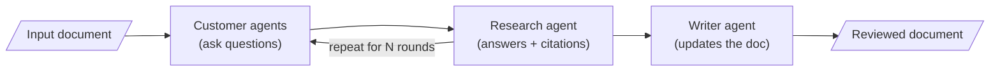
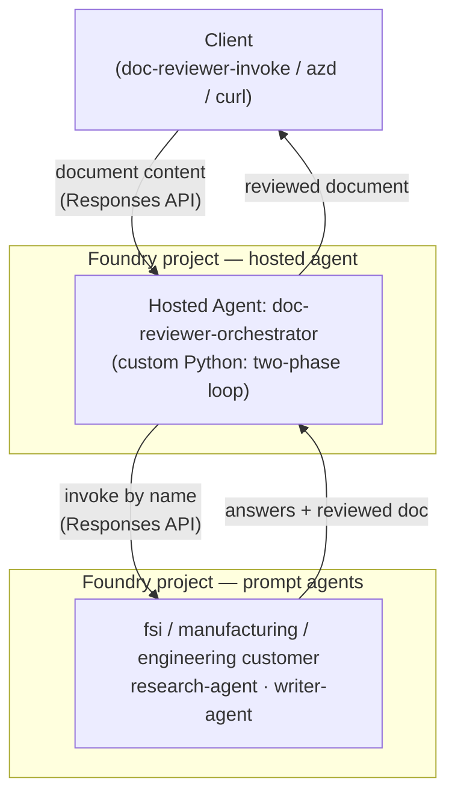

# Documentation Reviewer

A multi-agent system that reviews architecture and guidance documentation from industry-specific customer perspectives, using the [Microsoft Agent Framework](https://pypi.org/project/agent-framework/) with Azure OpenAI.

## How It Works



**Phase 1 — Customer Q&A:** Industry-specific customer agents (acting as IT Architects/CTOs) read your document and ask pointed questions about gaps and missing best practices. A Research Agent answers using local Markdown research docs plus Microsoft Learn and WorkIQ MCP tools.

**Phase 2 — Document Update:** A Writer Agent takes the original document plus the full conversation and produces an updated version with the new guidance incorporated.

## Agents

| Agent | Role | Tools |
|-------|------|-------|
| FSI Customer | CTO at a financial services company. Asks about security, compliance, network isolation. | None (LLM) |
| Manufacturing Customer | CTO at a manufacturer. Asks about edge, IoT, OT/IT convergence. | None (LLM) |
| Engineering Customer | Engineering lead/platform architect building agents in Foundry. Asks about DevOps, CI/CD, eval gates, versioning, rollback, and observability. | None (LLM) |
| Research Agent | Answers customer questions with researched best practices. | Local Markdown research docs, Microsoft Learn MCP, WorkIQ MCP |
| Writer Agent | Updates the document with new guidance from the review. | None (LLM) |

## Token usage & model selection

Each review makes `2 × rounds × industries + 1` agent calls, so token usage is
kept in check by design:

- The **document is sent only on each industry's first round** (and once to the
  writer) — not re-pasted every round — and the **research agent isn't sent the
  document at all** (it answers specific questions with its own tools).
- The transcript echoed into each turn is **capped** to recent messages, and
  `rounds` is clamped to a safe maximum.
- The **research agent** is instructed to make at most ~2 tool calls and answer
  concisely, so its MCP tool loop doesn't run away.
- Model rate-limit (429) errors are retried with exponential backoff.

Agents can run on **different model deployments** so they don't all share one
model's rate limit (each falls back to `AZURE_AI_MODEL_DEPLOYMENT_NAME`):

| Env var | Used by | Example |
|---------|---------|---------|
| `CUSTOMER_MODEL_DEPLOYMENT_NAME` | Customer agents (high volume, simple) | `gpt-4.1-mini` |
| `RESEARCH_MODEL_DEPLOYMENT_NAME` | Research agent (isolated; tool loops) | `gpt-4.1` |
| `WRITER_MODEL_DEPLOYMENT_NAME` | Writer agent (best quality, 1 call) | `gpt-5.4` |

Set these before deploying the prompt agents (`doc-reviewer-deploy --publish`);
the model is baked into each agent version.

## Setup

### Prerequisites

- Python 3.11+
- Azure AI Foundry project with a deployed model (e.g., `gpt-4o`)
- WorkIQ MCP server running locally
- Azure CLI authenticated (`az login`)

### Installation

```bash
pip install -r requirements.txt
```

### Configuration

Copy `.env.example` to `.env` and fill in your values:

```bash
cp .env.example .env
```

Required variables:
- `AZURE_AI_PROJECT_ENDPOINT` — Your Azure AI Foundry project endpoint
- `AZURE_AI_MODEL_DEPLOYMENT_NAME` — Model deployment name (default: `gpt-4o`)
- `WORKIQ_MCP_URL` — URL of your WorkIQ MCP server

Optional variables:
- `RESEARCH_DIR` — Directory containing local Markdown research docs (default: `research/` at the repository root)
- `LANGFUSE_ENABLED` — Set to `true` to enable Langfuse observability
- `LANGFUSE_BASE_URL` — Langfuse host URL (default for local Docker: `http://localhost:3000`)
- `LANGFUSE_PUBLIC_KEY` / `LANGFUSE_SECRET_KEY` — Langfuse project keys
- `LANGFUSE_ENABLE_SENSITIVE_DATA` — Set to `true` to capture prompts, responses, tool arguments, and tool results

## Langfuse Observability

The app can trace Microsoft Agent Framework runs to Langfuse using OpenTelemetry. Observability is disabled by default.

For a local Langfuse Docker instance running on your host machine, set:

```bash
LANGFUSE_ENABLED=true
LANGFUSE_BASE_URL=http://host.docker.internal:3000
LANGFUSE_PUBLIC_KEY=pk-lf-...
LANGFUSE_SECRET_KEY=sk-lf-...
LANGFUSE_ENABLE_SENSITIVE_DATA=false
```

The devcontainer maps `host.docker.internal` to the host gateway so code inside the container can reach host-running services. Rebuild/reopen the devcontainer after changing `.devcontainer/devcontainer.json`.

Keep `LANGFUSE_ENABLE_SENSITIVE_DATA=false` unless you explicitly want prompts, responses, tool arguments, and tool results in traces. Reviewed architecture documents may contain sensitive customer content.

## Usage

```bash
# Review with all industries (default)
doc-reviewer --file docs/architecture.md

# Review with specific industries
doc-reviewer --file docs/architecture.md --industry fsi

# Custom number of Q&A rounds
doc-reviewer --file docs/architecture.md --rounds 5 --industry fsi manufacturing engineering

# Review from an engineering/devops perspective
doc-reviewer --file docs/architecture.md --industry engineering

# Use a custom local research directory
doc-reviewer --file docs/architecture.md --research-dir ./research

# Run against agents already deployed to Foundry (prompt agents) instead of
# building them locally — see "Deploying Agents to Foundry" below
doc-reviewer --file docs/architecture.md --hosted --industry fsi
```

The updated document is saved as `<original_name>_reviewed.<ext>` in the same directory.

## Local Research Docs

Place Markdown research documentation in the repository-level `research/` folder. The Research Agent searches `*.md` files recursively, injects the most relevant snippets into its prompt, and cites the local Markdown path when it uses those findings. If the folder is missing or empty, the review continues using MCP tools only.

## Adding a New Industry

1. Create a package `src/doc_reviewer/agents/<industry>_customer/` (copy an existing customer folder such as `fsi_customer/`) with `instructions.py`, `factory.py`, `definition.py`, `agent.yaml`, `deploy.py`, `README.md`, and an `__init__.py` that re-exports the symbols
2. Register the industry in `src/doc_reviewer/agents/registry.py` (`CUSTOMER_INDUSTRIES` and `CUSTOMER_AGENT_PACKAGES`)
3. `main.py` (`SUPPORTED_INDUSTRIES`) and `base.create_customer_agent()` pick it up automatically from the registry

## Project Structure

Each agent is a **self-contained package** so it can run locally via the Microsoft Agent Framework or be deployed to Azure AI Foundry as a **prompt agent**.

```
.
├── research/            # Optional local Markdown research corpus
└── src/doc_reviewer/
    ├── main.py              # CLI entry point
    ├── config.py            # Environment configuration
    ├── orchestrator.py      # Two-phase conversation orchestrator
    ├── research_corpus.py   # Local Markdown research retrieval
    ├── agents/
    │   ├── base.py          # Backwards-compatible create_* factory API
    │   ├── shared.py        # Shared chat-client helper
    │   ├── registry.py      # Single source of truth for agents/industries
    │   ├── _deploy_common.py # Shared Foundry deploy helper
    │   ├── deploy_all.py    # Deploy all prompt agents
    │   ├── fsi_customer/    # FSI customer persona (instructions/factory/definition/agent.yaml/deploy)
    │   ├── manufacturing_customer/  # Manufacturing customer persona
    │   ├── engineering_customer/    # Engineering/DevOps customer persona
    │   ├── research/        # Research agent (with MCP tool definitions)
    │   └── writer/          # Document writer agent
    ├── host/                # Foundry Hosted Agent for the orchestrator (Responses protocol)
    └── document/
        └── loader.py        # Markdown/PDF loader
```

Every agent folder contains: `instructions.py` (system prompt), `factory.py` (`create_agent` for local runs), `definition.py` (`build_prompt_agent_definition` → Foundry `PromptAgentDefinition`), `agent.yaml` (metadata), `deploy.py` (publish/version to Foundry), and `README.md`.

## Deploying Agents to Foundry (prompt agents)

Each agent can be deployed to your Azure AI Foundry project as a versioned prompt agent. Deploys default to a **dry run** (they print the intended action); pass `--publish` to actually create/version the agent.

```bash
pip install "doc-reviewer[deploy]"

# Deploy a single agent
python -m doc_reviewer.agents.fsi_customer.deploy            # dry run
python -m doc_reviewer.agents.fsi_customer.deploy --publish  # publish

# Deploy all agents
doc-reviewer-deploy            # dry run
doc-reviewer-deploy --publish  # publish
```

Deployment reuses `AZURE_AI_PROJECT_ENDPOINT` and `AZURE_AI_MODEL_DEPLOYMENT_NAME`. Authentication uses `DefaultAzureCredential` (run `az login`).

### MCP tools for the hosted Research agent

When deployed, the Research agent runs in Foundry's cloud, so its MCP tools differ from the local run:

- **Microsoft Learn** (public) is always included.
- **WorkIQ / GitHub** require either a cloud-reachable URL or — for authenticated servers — a **Foundry connection**. Foundry rejects inline auth tokens/headers on MCP tools, so set `GITHUB_MCP_CONNECTION_ID` (and optionally `WORKIQ_MCP_CONNECTION_ID`) to a connection in your project. A `localhost` URL (e.g. a local WorkIQ) is unreachable from the cloud and is skipped automatically with a warning.

### Running against the hosted agents

Once deployed, run the review against the hosted prompt agents instead of building them locally:

```bash
doc-reviewer --file docs/architecture.md --hosted
```

In `--hosted` mode, `main.py` calls `run_review_hosted`, which invokes each deployed agent **by name** through the project's Responses API (`get_openai_client(agent_name=...).responses.create(...)`); the model, instructions, and tools are resolved server-side. The same two-phase conversation loop drives both local and hosted execution.

## Hosting the orchestrator (Foundry Hosted Agent)

The sub-agents above deploy as **prompt agents**, but the **orchestrator** (the
two-phase round loop) is custom Python. To run the whole review as a single
managed Azure endpoint, host the orchestrator as a Foundry **Hosted Agent**
(Pro-code) using the **Responses** protocol. It wraps `run_review_hosted` and
calls the sub-agent prompt agents by name.



```bash
pip install ".[host]"   # requires Python 3.13+ (Hosted agents requirement)
```

Then deploy with `azd` from `src/doc_reviewer/host/`:

```bash
azd ext install microsoft.foundry
azd ai agent init --protocol responses --deploy-mode code
azd provision
azd deploy
azd ai agent invoke '{"document": "# My doc\n...", "industries": ["fsi"], "rounds": 2}'
```

The endpoint accepts a JSON body `{"document", "industries"?, "rounds"?}` (or
plain document text) and returns the reviewed document. To call it from a local
file, use the bundled client (it sends the file's **content**, not a path):

```bash
export DOC_REVIEWER_AGENT_ENDPOINT="https://<account>.services.ai.azure.com/api/projects/<project>"
doc-reviewer-invoke --file docs/architecture.md --industry fsi --rounds 1
```

See [`src/doc_reviewer/host/README.md`](src/doc_reviewer/host/README.md) for the full
runbook, all invocation options (script / azd / Python / curl), container
(`Dockerfile`) deploy path, and required roles.

## License

MIT
