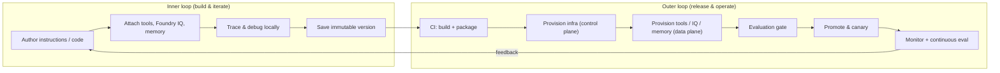
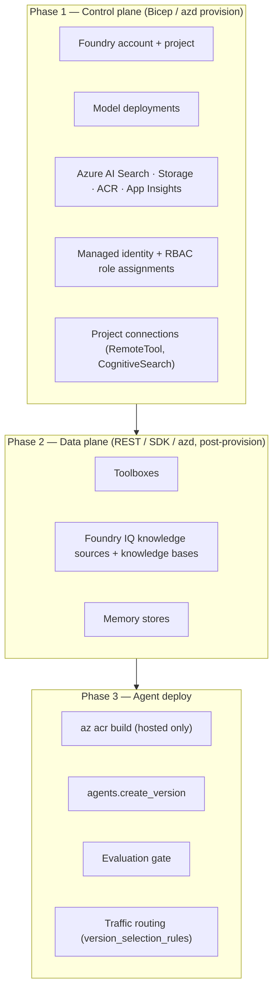
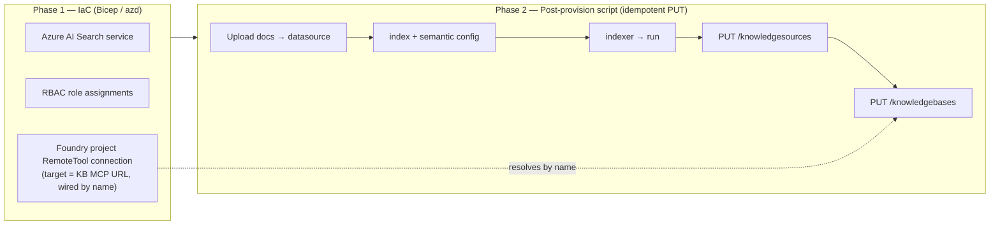

# AgentOps: operationalize Microsoft Foundry agents

This article provides guidance to platform and workload teams that build agents on Microsoft Foundry and want to operate them with the same rigor they apply to any other production software. *AgentOps* is the discipline of provisioning, versioning, evaluating, deploying, and monitoring agents and their dependencies—models, instructions, tools, knowledge, and memory—through automated, repeatable pipelines.

AgentOps is the agent-native evolution of [GenAIOps (LLMOps)](/azure/architecture/ai-ml/guide/genaiops-for-mlops). GenAIOps operationalizes prompts and retrieval-augmented generation (RAG) pipelines. AgentOps extends those practices to *agents*: autonomous units that combine a model, instructions, a set of tools, grounded knowledge, and persistent memory, and that make their own decisions about which tools to call. This shift changes what you version, what you gate on, and what you observe in production.

> [!NOTE]
> This article focuses on the *operational* layer: how you build pipelines, promote across environments, gate on quality, and observe a fleet of agents. For the single-agent inner-loop build experience—choosing an agent type, creating and testing it in the playground, saving versions, and publishing—see [Agent development lifecycle](/azure/foundry/agents/concepts/development-lifecycle). AgentOps builds on that lifecycle rather than repeating it.

## What makes agents different to operate

Traditional application operations deploy code artifacts. GenAIOps adds prompt and index artifacts. AgentOps introduces several characteristics that reshape your operational model:

- **The agent is the unit of deployment and governance.** An agent bundles a model deployment, instructions, tools, knowledge connections, and memory configuration. You version and promote the agent as a whole, not just its code or its prompt.
- **Agent versions are immutable.** In Foundry, each saved version of an agent is immutable. Any change to the model, instructions, or tools produces a new version. You refer to an agent as `<agent_name>:<version>`, and you route traffic to specific versions. This immutability is the foundation of safe rollout and rollback. For more information, see [Agent development lifecycle](/azure/foundry/agents/concepts/development-lifecycle).
- **Control-plane and data-plane resources split.** Some dependencies—the Foundry account and project, model deployments, Azure AI Search, storage, and role assignments—are Azure Resource Manager (ARM) resources that you provision with Bicep or the Azure Developer CLI (`azd`). Others—toolboxes, Foundry IQ knowledge sources and knowledge bases, and memory stores—are *data-plane* resources with no ARM representation. You create them with REST or SDK calls *after* infrastructure exists. This split is the defining constraint of AgentOps pipelines.
- **Behavior is non-deterministic, so you gate on evaluation, not just tests.** Unit and integration tests still matter, but the release gate that matters most is an *evaluation* that scores quality and safety against thresholds.
- **State outlives the session.** Agents can retain long-term memory across sessions and users. Memory becomes an operational asset with its own retention, governance, and privacy lifecycle.

## Agent hosting models

AgentOps must account for the three ways you run agents in Foundry, because their deployment mechanics differ:

| Hosting model | What it is | How you deploy it |
| --- | --- | --- |
| **Prompt agent** | A declaratively defined agent: a model, instructions, tools, and knowledge. No container. Managed runtime. | Create a new version with the SDK/REST `create_version`, supplying a `PromptAgentDefinition`. |
| **Hosted agent** | Your own containerized code (Microsoft Agent Framework, LangGraph, Semantic Kernel, Copilot SDK, or plain Python) running on Foundry serverless compute. | Build a container image, then `create_version` with a `HostedAgentDefinition`. |
| **Workflow** | An orchestration of multiple agents or a sequence of actions. | Same versioning and lifecycle apply; authored in the portal or code. |

Both prompt and hosted agents call the **same Responses API** on the Foundry project endpoint and therefore share the same tool catalog—web search, code interpreter, file search, function calling, MCP, OpenAPI, Azure AI Search, Work IQ, Fabric IQ, SharePoint, and Foundry IQ knowledge bases. As a result, most AgentOps practices apply to both; the main difference is that hosted agents add a container build and image-promotion step.

## The AgentOps inner and outer loops

Like GenAIOps, AgentOps has an inner loop (build and iterate) and an outer loop (release and operate). The inner loop is largely the [agent development lifecycle](/azure/foundry/agents/concepts/development-lifecycle). The outer loop is what this article contributes.



The rest of this article walks the outer loop, then covers the cross-cutting concerns—tools, Foundry IQ, memory, evaluation, observability, security, and environment strategy—through an operational lens.

## DevOps for agents

### Source of truth and versioning

Treat every element of an agent as version-controlled source:

- **Prompt agents:** the instructions live in a prompt file (for example, `agent-instructions.md`) in your repository. The pipeline stamps each deployed version with metadata such as a content hash and the originating Git SHA so you can trace any running version back to a commit.
- **Hosted agents:** the container source, `Dockerfile`, and an `agent.yaml` manifest live in the repository. The build produces an immutable image tag; the deployment produces an immutable agent version.
- **Both:** tool attachments, connection references, Foundry IQ bindings, and memory configuration are declared as code (manifest or Bicep parameters) so an environment can be reconstructed deterministically.

The core deployment primitive for both hosting models is `agents.create_version(...)` (available through the `azure-ai-projects` SDK and the REST API). Because versions are immutable, promotion never mutates a running version—it creates a new one and shifts traffic.

<!-- Added based on ENGINEERING review -->
For production delivery, treat the deployed agent as a **composite release artifact**, not just an agent version. The artifact should capture the exact combination of:

- prompt files or hosted-agent code
- `agent.yaml` or agent manifest
- toolbox definitions
- Foundry IQ knowledge source and knowledge base specs
- memory-store configuration
- model deployment names
- API versions used for each data-plane operation

A practical repository structure is:

```text
/agent
  agent.yaml
  agent-instructions.md
  /src
/toolbox
  toolbox.yaml
/knowledge
  knowledge-sources/
  knowledge-bases/
/memory
  memory-store.yaml
/release
  release-manifest.json
```

A useful `release-manifest.json` includes fields such as:

- `releaseVersion`
- `gitCommit`
- `agentVersion`
- `toolboxSpecDigest`
- `knowledgeSourceSpecs[]`
- `knowledgeBaseSpecs[]`
- `memoryConfigDigest`
- `searchIndexSchemaVersion`
- `modelDeployments`
- `apiVersions`
- `createdByPipelineRun`
- `environmentPromotionHistory`

Promote this release bundle unchanged across dev, test, and prod. The environment should vary only by parameter values such as names, endpoints, and model deployment identifiers—not by manual edits to the artifact. This approach prevents drift between the agent version and the data-plane configuration it was evaluated against.

### The two-phase provisioning reality

The single most important structural fact in AgentOps is that agents depend on both control-plane and data-plane resources, and only the control plane has Bicep/ARM support.



Because toolboxes, knowledge sources, knowledge bases, and memory stores have no ARM resource type, your pipeline provisions infrastructure first, then runs an idempotent *post-provision* step (a `postprovision` hook or a dedicated pipeline job) that calls the data-plane REST or SDK APIs. Design these calls to be idempotent—use HTTP `PUT` (create-or-update) so re-runs are safe.

<!-- Added based on ENGINEERING review -->
After applying data-plane specs, add a **read-back validation** step before agent creation or promotion. The pipeline should query the deployed toolbox, knowledge, and memory definitions, compute digests, and compare them with the release manifest. Only if the actual deployed state matches the manifest should the pipeline continue to create or route traffic to the new agent version. This validation closes the gap created by the lack of ARM-native drift control for data-plane objects.

### CI/CD for prompt agents

The prompt-agent pipeline is lightweight because there is no container:

1. **Stage a candidate.** On a pull request, call `create_version` with the instructions from the prompt file. Tag the version as a candidate (for example, with metadata `candidate=true` and the PR number) so it is never promoted accidentally.
2. **Gate on evaluation.** Run the evaluation suite against the candidate version. Fail the pipeline if any evaluator falls below its threshold.
3. **Record the deployment.** On merge, create the version in the target environment and route traffic to it.

```python
created = client.agents.create_version(
    agent_name,
    body={
        "definition": {
            "kind": "prompt",
            "model": "gpt-4o-mini",
            "instructions": instructions_text,
        },
        "metadata": {
            "env": "dev",
            "prompt_sha256": prompt_hash,
            "git_sha": git_sha,
        },
    },
)
```

<!-- Added based on ENGINEERING review -->
For prompt agents, the orchestration layer that calls the agent should also stamp the active `releaseVersion` and dependency digests into request telemetry. Prompt agents do not have a custom runtime where you can always inject tracing logic directly, so the caller or gateway becomes the place to attach release metadata consistently to conversation telemetry and downstream evaluation cohorts.

### CI/CD for hosted agents

Hosted agents add a container build and an activation wait to the flow:

1. **Build the image remotely.** Use `az acr build` (or an equivalent CI build) to produce an immutable, tagged image in Azure Container Registry.
2. **Create the version.** Call `create_version` with a `HostedAgentDefinition` that references the image, CPU/memory sizing, supported protocol versions, and environment variables.
3. **Wait for activation.** A new version transitions from `creating` to `active`; poll until it is active before routing traffic. Versions are immutable once active, so any code or configuration change becomes a new version.

```python
project.agents.create_version(
    agent_name=image_name,
    definition=HostedAgentDefinition(
        cpu="2", memory="4Gi",
        container_configuration=ContainerConfiguration(image=image_ref),
        protocol_versions=[ProtocolVersionRecord(protocol=AgentProtocol.RESPONSES, version="1.0.0")],
        environment_variables=env_vars,
    ),
)
```

Hosted agents also get a **dedicated Entra ID (managed identity)** per agent, which the platform uses for tool and resource access. Account for that identity in your RBAC provisioning (see [Security, identity, and governance](#security-identity-and-governance)).

<!-- Added based on ENGINEERING review -->
For hosted agents, propagate release-manifest fields end-to-end by attaching them as **OpenTelemetry span attributes** and therefore as **Application Insights custom dimensions** on the root conversation span. Copy the same attributes to child spans for tool calls and custom execution paths. At a minimum, stamp:

- `releaseVersion`
- `agentVersion`
- `toolboxDigest`
- `kbDigest`
- `memoryDigest`

This pattern makes traces, tool failures, latency, token usage, and trace-based evaluations queryable per release in Application Insights and Log Analytics. For external or custom tool executors, propagate the same correlation context so their spans join the same operation tree.

### The azd lifecycle

The Azure Developer CLI with the Foundry extension gives you a consistent, scriptable lifecycle that maps cleanly onto the two-phase model:

```bash
azd ext install microsoft.foundry
azd ai agent init -m <manifest-url> --deploy-mode code   # scaffold agent.yaml, azure.yaml, infra/
azd provision                                            # Phase 1: account, project, model, ACR, identity, RBAC
azd ai agent run                                         # local dev loop + Agent Inspector
azd deploy                                               # build image + create_version + route traffic
azd up                                                   # provision + deploy in one step
azd ai agent monitor --follow                            # stream logs
```

Data-plane resources are wired in as `postprovision` and `postdeploy` hooks in `azure.yaml` so that a single `azd up` produces a fully working environment.

### Canary rollout and rollback

Because versions are immutable and addressable, you split traffic across versions with `version_selection_rules` on the agent endpoint. Start a new version at a small percentage, watch its signals, and increase the ratio as confidence grows:

```bash
az rest --method PATCH --url "${BASE_URL}/agents/${AGENT_NAME}?api-version=v1" \
  --headers "Foundry-Features=AgentEndpoints=V1Preview" \
  --body '{"agent_endpoint":{"version_selector":{"version_selection_rules":[
     {"agent_version":"1","traffic_percentage":90,"type":"FixedRatio"},
     {"agent_version":"2","traffic_percentage":10,"type":"FixedRatio"}]}}}'
```

Rollback is a single operation: route 100% of traffic back to the previous version. Because old versions remain `active`, rollback is instant and requires no rebuild.

<!-- Added based on ENGINEERING review -->
For **data-plane rollback**, do not rely on in-place mutation of live toolboxes, knowledge bases, indexes, or memory-store settings. Instead, use **versioned side-by-side dependencies** such as:

- `toolbox-v2026-07-01`
- `kb-customerhelp-v17`
- `memorycfg-v5`

Promote by updating the composite release manifest so the candidate agent version points to the new dependency set. Roll back by restoring traffic to the previous agent version **and** restoring the prior manifest bindings if the failure is caused by a data-plane change. This pattern avoids leaving a known-good agent version attached to incompatible tool or knowledge resources.

### A reference pipeline shape

A GitHub Actions or Azure DevOps pipeline for agents mirrors the two-phase model, with an evaluation gate between deploy and promote. The jobs are sequenced so that data-plane provisioning always follows infrastructure, and traffic shifts only after the gate passes:

```yaml
jobs:
  provision-infra:            # Phase 1 (control plane)
    steps:
      - uses: azure/login@v2   # OIDC federated credential, no stored secret
      - run: azd provision --no-prompt

  provision-dataplane:        # Phase 2 (data plane, idempotent PUT)
    needs: provision-infra
    steps:
      - uses: azure/login@v2
      - run: ./scripts/setup-toolbox.sh
      - run: ./scripts/setup-knowledge-base.sh
      - run: ./scripts/setup-memory-store.sh

  deploy-and-gate:            # Phase 3 (deploy + evaluate)
    needs: provision-dataplane
    steps:
      - run: azd deploy --no-prompt            # build image + create_version (candidate)
      - run: python ./eval/run_eval.py         # fails the job if thresholds are missed

  promote:                    # route traffic only if the gate passed
    needs: deploy-and-gate
    steps:
      - run: ./scripts/route-traffic.sh        # PATCH version_selection_rules (canary → 100%)
```

Design rules that keep this pipeline safe to re-run:

| Concern | Approach |
| --- | --- |
| Idempotency | Provision all data-plane objects with HTTP `PUT` (create-or-update). |
| Secrets | Use `DefaultAzureCredential` with OIDC federated identity; avoid stored keys. |
| Concurrency | Use `If-Match` ETags on data-plane updates. |
| Schema migration | Create new objects under new names, validate, then delete the old. |
| Transient warm-up | Retry `503` responses during service warm-up. |
| Environment promotion | Parameterize names and models per `azd env`; never hardcode. |

<!-- Added based on ENGINEERING review -->
For stronger release discipline, extend the pipeline with these checks:

1. **Generate the composite release manifest** and publish it as a build artifact.
2. **Apply data-plane specs using pinned API versions** recorded in that manifest.
3. **Read back deployed definitions and compare digests** to the manifest.
4. **Create the candidate agent version only after dependency validation passes.**
5. **Stamp the release metadata into telemetry and evaluation context.**
6. **Promote only after canary bake time, minimum sample size, and health checks succeed.**

This pattern lets teams answer a critical operational question: *exactly which toolbox, knowledge-base, index schema, and memory configuration was this running agent version tested and promoted with?*

### Recommended tooling

| Tool | Role in AgentOps |
| --- | --- |
| **`azd` + Foundry extension** | Scaffold, provision (Bicep), deploy, run locally, manage connections and toolboxes. |
| **`agents.create_version`** (SDK/REST) | Core deployment primitive for prompt and hosted agents. |
| **Bicep** | Phase-1 control-plane infrastructure. |
| **AgentOps accelerator** | Generates GitHub Actions and Azure DevOps pipelines with evaluation gates and evidence packs. |
| **GitHub Actions / Azure DevOps** | Pipeline orchestration; use OIDC federated credentials rather than stored secrets. |

## DevOps for tools and toolboxes

Tools are what make an agent an agent, and in AgentOps they are first-class deployment artifacts. Foundry exposes built-in tools (web search, code interpreter, file search, function calling) and custom tools (MCP, OpenAPI, agent-to-agent, Azure AI Search, Work IQ, Fabric IQ, SharePoint, browser automation). A **toolbox** bundles several tools behind a single MCP endpoint that agents attach to.

Operational characteristics:

- **Toolboxes are data-plane.** There is no Bicep resource for a toolbox. Provision the underlying connections in Phase 1 (with `azd ai connection create` or `az rest`), then create the toolbox in Phase 2 (`azd ai toolbox create` or a REST `POST .../toolboxes/{name}/versions`). Declare tools and connections in an `agent.manifest.yaml` so they are reproducible.
- **Connections carry auth.** Authenticated MCP servers must be attached through a project connection (managed identity), not inline headers—Foundry rejects inline credentials for MCP tools. Provision the connection in IaC and reference it by name from the toolbox.
- **Version and validate tools like code.** A tool schema change can alter agent behavior. Gate tool changes behind the same evaluation suite you use for the agent, and confirm the agent still calls the expected tools by inspecting traces.

<!-- Added based on ENGINEERING review -->
For change management, version toolboxes side-by-side rather than updating them in place. When a tool schema changes, create a new toolbox version or a new named toolbox, validate it against the candidate agent version, and cut over only through a manifest update. If a release fails, restore the prior toolbox binding instead of editing the live toolbox back to an older shape. This preserves rollback safety and keeps the deployed state auditable.

## DevOps for Foundry IQ (knowledge)

[Foundry IQ](/azure/foundry/agents/concepts/what-is-foundry-iq) is Foundry's managed, permission-aware knowledge layer, built on Azure AI Search agentic retrieval. Agents query a **knowledge base** (which references one or more **knowledge sources**) as a tool over an MCP endpoint. Both prompt and hosted agents can consume the same knowledge base.

The defining operational fact: **knowledge sources and knowledge bases are data-plane objects on Azure AI Search—they are not ARM resources.** There is no Bicep, Terraform, or `az search` resource type for them. Your CI/CD therefore follows a strict two-phase shape.



Operational guidance:

- **Wire the connection before the knowledge base exists.** Bicep can register a `RemoteTool` project connection whose target is the knowledge base MCP URL by name. The connection resolves once the post-provision script creates the knowledge base.
- **Make data-plane calls idempotent.** Use HTTP `PUT` for knowledge sources and knowledge bases so pipeline re-runs are safe. Use `If-Match` ETags to guard concurrent updates, and retry transient `503`s during service warm-up.
- **Handle schema changes by new name, not overwrite.** When a source or index schema changes, create the new object under a new name, validate it, then delete the old one. This avoids breaking live queries mid-migration.
- **Provision RBAC precisely.** The deployer needs `Search Service Contributor` and `Search Index Data Contributor` to author objects and load documents. The Search service managed identity needs `Cognitive Services User` on the model resource for query planning. The agent's runtime identity needs `Search Index Data Reader` to query at run time.
- **Parameterize per environment.** Knowledge base name, index name, and model deployment should be `azd env` values so dev, test, and prod stay isolated.

<!-- Added based on ENGINEERING review -->
For stateful knowledge migrations, use an **expand / migrate / contract** sequence:

1. **Expand:** create the new index, knowledge source, and knowledge base side-by-side under new names.
2. **Migrate:** fully backfill and validate the new index before any traffic cutover.
3. **Compatibility window:** during bake time, ensure the agent or tool layer can tolerate both old and new schemas if both may be queried.
4. **Cut over by manifest:** point the promoted release manifest to the fully built and validated knowledge set.
5. **Contract:** retire the old index and knowledge-base objects only after the new set has passed canary and bake time.

This approach aligns with Azure Well-Architected safe deployment practices for stateful changes and avoids promoting an agent against partially migrated retrieval state. See [Safe deployment practices](/azure/well-architected/operational-excellence/safe-deployments).

## DevOps for memory

[Memory](/azure/foundry/agents/concepts/what-is-memory) (preview) is Foundry Agent Service's managed long-term memory. It lets an agent retain knowledge across sessions, devices, and workflows through a managed **memory store**. Memory changes the operational surface because it introduces durable, user-scoped state that has its own lifecycle, governance, and privacy obligations.

Memory operates in three phases—**extraction** (pull salient facts from a conversation), **consolidation** (merge duplicates and resolve conflicts), and **retrieval** (surface relevant memories into context). It stores three types of long-term memory:

| Memory type | What it holds | Operational note |
| --- | --- | --- |
| **User profile memory** | Durable user preferences and personal context. | Retrieve early in a conversation for stable personalization. |
| **Chat summary memory** | Distilled summaries of prior conversation threads. | Retrieve per turn for continuity. |
| **Procedural memory** | Reusable how-to routines inferred from prior interactions. | Retrieve when a recurring task recurs. |

AgentOps considerations for memory:

- **Provision the store as a data-plane resource.** Like toolboxes and knowledge bases, memory stores are created through the Memory Store API, not ARM. Add their creation to your post-provision step and parameterize retention defaults per environment.
- **Set retention (TTL) intentionally.** Store-level default TTL and item-level create/read/update/list/delete give you control over the data lifecycle. Encode retention as environment configuration so it satisfies compliance requirements in each environment.
- **Choose the integration mode deliberately.** You can attach a **memory search tool** to a prompt agent (simplest—the agent reads and writes memory during conversations) or call the **memory store APIs** directly (more control over records, retention, and explicit remember/forget behavior). Pick one per agent and keep it consistent across environments.
- **Scope memory per user for isolation.** Memory is scoped—typically per user or a custom key—for privacy and security. Enforce scoping in code and verify it in evaluation.
- **Test memory behavior explicitly.** Memory makes behavior stateful, so include memory scenarios in your evaluation datasets: does the agent recall a stored preference? Does an explicit "forget" command take effect? Does isolation hold across users? Treat direct remember-or-forget commands as testable behavior.
- **Govern memory in production.** Memory items are reviewable and deletable in the Foundry portal and through APIs. Build an operational runbook for audit, deletion (including *right to be forgotten* requests), and drift review.

> [!TIP]
> Use memory for user-specific or agent context that is *learned* over time; use a Foundry IQ knowledge base to ground on *curated organizational content*; use the file search tool for documents provided *during* an interaction. Keeping these responsibilities separate simplifies operations.

<!-- Added based on ENGINEERING review -->
For stateful memory changes, apply the same safe-deployment discipline as for knowledge migrations. If a memory-store schema or policy change requires migration, prefer:

- **side-by-side memory configuration versions**
- **optional dual-write during validation**
- **read compatibility during the bake window**
- **manifested cutover only after validation completes**

Do not promote an agent version that depends on partially migrated long-term memory state. For rollback, re-point to the previous memory configuration or store version rather than attempting reverse migration of live memory data unless you have explicitly engineered and tested that path.

## Evaluation

Evaluation is the release gate of AgentOps. Because agent behavior is non-deterministic, passing unit tests is not sufficient—you gate promotion on scored quality and safety.

Foundry provides built-in evaluators that combine rule-based checks and AI judges:

| Evaluator | What it measures |
| --- | --- |
| **Task adherence** | Does the agent follow its system instructions? |
| **Coherence** | Is the response logical and well-structured? |
| **Safety** (for example, violence) | Does the response contain harmful content? |

You can also author [custom evaluators](/azure/foundry/concepts/evaluation-evaluators/custom-evaluators) and [agent-specific evaluators](/azure/foundry/concepts/evaluation-evaluators/agent-evaluators) for tool use and intent resolution.

Operationalizing evaluation:

- **Version test datasets as code.** Create JSONL datasets of representative queries, upload them to the project, and keep them under source control so evaluations are reproducible.
- **Set explicit acceptance thresholds.** Define pass thresholds—for example, *task adherence ≥ 85%* or *coherence ≥ 3*—and fail the pipeline when a version misses them. AI-assisted evaluators require a judge model deployment; pin the judge model per environment for comparable scores.

Configure evaluators declaratively so the same criteria run in every environment. Each evaluator maps test data and agent output to the fields it scores, and AI-assisted evaluators name the judge model deployment:

```python
testing_criteria = [
    {
        "type": "azure_ai_evaluator",
        "name": "Task Adherence",
        "evaluator_name": "builtin.task_adherence",
        "data_mapping": {"query": "{{item.query}}", "response": "{{sample.output_items}}"},
        "initialization_parameters": {"deployment_name": judge_model},
    },
    {
        "type": "azure_ai_evaluator",
        "name": "Coherence",
        "evaluator_name": "builtin.coherence",
        "data_mapping": {"query": "{{item.query}}", "response": "{{sample.output_text}}"},
        "initialization_parameters": {"deployment_name": judge_model},
    },
    {
        "type": "azure_ai_evaluator",
        "name": "Violence",
        "evaluator_name": "builtin.violence",
        "data_mapping": {"query": "{{item.query}}", "response": "{{sample.output_text}}"},
    },
]
```

- **Gate every promotion.** Run the same evaluation suite at every environment boundary (dev → test → prod). A version is promoted only if it clears the gate, and every promotion ties back to an immutable version artifact for auditability.
- **Isolate evaluation sessions.** For hosted agents, isolate eval runs from real traffic (for example, with a per-run session isolation key) so evaluation never pollutes production state or memory.
- **Run continuous evaluation in production.** Evaluation is not a one-off pre-release check. Apply the same evaluators to sampled production traffic to detect drift, regressions, and new failure modes, and feed the results back into the inner loop.

<!-- Added based on ENGINEERING review -->
For production rollout control, use evaluations in two modes:

- **pre-promotion evaluation** in CI/CD against staged candidate versions
- **continuous or trace-based evaluation** on sampled production traffic after canary

Programmatically query evaluation runs and rules by agent identity and release cohort, and correlate them with telemetry using the stamped release metadata described earlier. Foundry documents continuous evaluation, evaluation-rule filtering, agent dashboards, and trace-based evaluation patterns; use those capabilities as inputs to your promotion controller rather than as a standalone rollback system. For more information, see:
- [Evaluate your AI agents](/azure/foundry/observability/how-to/evaluate-agent)
- [Monitor agents dashboard](https://learn.microsoft.com/azure/foundry/observability/how-to/how-to-monitor-agents-dashboard)
- [Observability in Azure AI Foundry](https://learn.microsoft.com/azure/foundry/concepts/observability)

## Observability and monitoring

Treat a published agent like production software. Foundry's observability stack integrates tracing and metrics with Azure Monitor and OpenTelemetry.

- **Tracing.** Use agent tracing to confirm which tools were called, inspect tool inputs and outputs, and find latency hotspots across model and tool calls. Traces are your primary tool for diagnosing behavior changes after a rollout.
- **Metrics and dashboards.** Emit telemetry to Application Insights via OpenTelemetry so you can monitor quality, safety, latency, and cost across the fleet. If you run hosted agents on scale-to-zero compute, flush telemetry after each request so spans are not lost.
- **Continuous evaluation on live traffic.** Combine tracing with sampled production evaluation to catch issues that staged datasets miss.
- **Close the feedback loop.** Route production findings—failed evaluations, negative user feedback, new failure modes—back into datasets and instructions so the next inner-loop iteration improves measurably.

<!-- Added based on ENGINEERING review -->
Require a minimum SRE dashboard and alert set for every production agent release. At a minimum, monitor these **golden signals** by `releaseVersion` and agent identity:

| Signal area | Required measures |
| --- | --- |
| **Availability** | request success rate, tool-call success and failure by tool, 5xx rate |
| **Latency** | p50/p95/p99 end-to-end latency, per-tool latency, timeout rate |
| **Quality** | evaluation pass rate, task success, relevance or groundedness where applicable |
| **Cost** | tokens per request, cost per conversation, expensive-tool usage |
| **Safety** | policy violations, fallback rate, hallucination or ungrounded-answer rate |

Store operational data in these systems:

- **Application Insights / Log Analytics** for traces, latency, failures, token and cost telemetry, and release-correlated conversation telemetry
- **Foundry evaluation artifacts and APIs** for evaluation runs and continuous evaluation results
- **Git and artifact storage** for dependency specs, release manifests, and promotion evidence packs

Stamp the release manifest identifiers into root spans and child spans so all runtime telemetry is queryable by the exact release being canaried or promoted.

<!-- Added based on ENGINEERING review -->
Use automated canary-abort criteria rather than manual observation alone. Representative triggers include:

- p95 latency regression greater than 20% versus baseline
- tool failure rate above SLO
- evaluation pass rate below threshold
- token cost per request above budget guardrails
- safety incident or ungrounded-answer rate above threshold

Treat these values as starting points; tune them per workload and traffic profile.

<!-- Added based on ENGINEERING review -->
Foundry provides the telemetry and evaluation plumbing, but most teams still need an external **promotion controller** to combine those signals into a release decision. A practical architecture is:

- run the controller in CI/CD, Azure Functions, or a Container Apps job
- give it read access to Application Insights or Log Analytics
- give it permission to query Foundry evaluation runs
- give it permission to execute traffic-routing or promotion actions

Its control loop should be:

1. deploy a canary release
2. wait for minimum sample size and bake time
3. query telemetry and evaluation results by `releaseVersion`
4. apply a multi-signal health model
5. either continue rollout or restore the previous traffic route and manifest bindings

To reduce false rollbacks, do not act on a single noisy signal. Require minimum traffic volume, allow for telemetry delay, and use multiple indicators together, especially for stateful releases. See [Safe deployment practices](/azure/well-architected/operational-excellence/safe-deployments).

## Security, identity, and governance

Agents act on behalf of users and reach into downstream systems, so identity and least privilege are central to AgentOps.

- **Per-agent identity.** Hosted agents each get a dedicated Entra ID. Assign only the roles each agent needs on the specific resources it touches.
- **Least-privilege RBAC.** Prefer role assignments over embedded keys. A representative matrix for a Foundry IQ–backed agent:

  | Identity | Role | Scope |
  | --- | --- | --- |
  | Deployer / pipeline SP | Search Service Contributor + Search Index Data Contributor | Search service |
  | Search service managed identity | Cognitive Services User | Model resource (query planning) |
  | Agent runtime identity | Search Index Data Reader | Search service (query time) |
  | Deployer | Foundry Project Manager + Foundry User | Foundry project |

  > [!NOTE]
  > Foundry RBAC roles were renamed—**Foundry User**, **Foundry Owner**, **Foundry Account Owner**, and **Foundry Project Manager** were previously *Azure AI User/Owner/Account Owner/Project Manager*. Role IDs and permissions are unchanged.

- **Secrets through connections, not code.** Store secrets in a managed secret store (for example, Key Vault) and reference them through connections. Never embed keys in code, configuration, prompts, or images.
- **Use federated identity in pipelines.** Authenticate CI/CD with OIDC federated credentials rather than long-lived secrets.
- **Govern memory and knowledge.** Enforce per-user memory scoping, honor deletion requests, and maintain search-index freshness and *right to be forgotten* compliance for grounded data.

<!-- Added based on ENGINEERING review -->
If you implement an external promotion or rollback controller, grant it only the permissions it needs:

- read access to Application Insights or Log Analytics
- permission to query Foundry evaluation results
- permission to invoke deployment or traffic-routing actions

Keep this controller separate from the agent runtime. Do not embed deployment authority inside the agent itself.

## Environment strategy

Use isolated environments and parameterize everything that differs between them:

- **One `azd env` per environment** (dev, test, prod), each with its own Foundry project or clearly separated resources.
- **Parameterize** model deployments, knowledge base and index names, memory retention defaults, and traffic-routing ratios in `main.parameters.json` and `azd env` values.
- **Promote by re-running the pipeline** against the next environment—provision (control plane), post-provision (data plane), deploy, and gate on evaluation—so promotion is deterministic and auditable.

<!-- Added based on ENGINEERING review -->
Promote the **same composite release artifact** across environments, and record each promotion in the release manifest or evidence pack. Environment promotion should update only environment-scoped parameters and bindings, not the content digests of the artifact itself. If the artifact or dependency digests change, treat that as a new release and re-run evaluation.

## Considerations

- **Preview features evolve quickly.** Memory, hosted agents, Foundry IQ synthesis, and several tools are in preview with region restrictions and changing API versions. Verify the current `api-version` and regional availability before you implement.
- **No single native IaC for data-plane objects.** Toolboxes, knowledge sources, knowledge bases, and memory stores require REST/SDK provisioning. Standardize on idempotent post-provision scripts and keep them in source control.
- **Known limitations exist.** For example, bundling a Foundry IQ knowledge base inside a toolbox and consuming it from the Responses API can hit a dotted tool-name issue; the workaround is to attach the knowledge base as a direct MCP tool. Track such constraints in your runbooks.
- **Right-size sessions and state.** Account for hosted-agent idle timeouts and state persistence, and for memory retention, when you design for reliability and compliance.

<!-- Added based on ENGINEERING review -->
- **Foundry does not provide a turnkey composite rollback controller.** Foundry provides tracing, Application Insights integration, dashboards, and evaluation APIs, but teams usually need to implement their own controller or pipeline logic to combine those signals into promotion and rollback decisions.
- **Stateful rollback is harder than stateless rollback.** For knowledge indexes and memory-related changes, prefer side-by-side deployment, bake time, and manifest cutover over reverse migration of live state.

## Next steps

- [Agent development lifecycle](/azure/foundry/agents/concepts/development-lifecycle)
- [GenAIOps for organizations with MLOps investments](/azure/architecture/ai-ml/guide/genaiops-for-mlops)
- [What are Hosted agents?](/azure/foundry/agents/concepts/hosted-agents)
- [What is Foundry IQ?](/azure/foundry/agents/concepts/what-is-foundry-iq)
- [What is Memory?](/azure/foundry/agents/concepts/what-is-memory)
- [Evaluate your AI agents](/azure/foundry/observability/how-to/evaluate-agent)
- [Foundry tool catalog](/azure/foundry/agents/concepts/tool-catalog)
- [Connect agents to Foundry IQ](/azure/foundry/agents/how-to/foundry-iq-connect)

## Related resources

- [MLOps and GenAIOps for AI workloads on Azure](/azure/well-architected/ai/mlops-genaiops)
- [Design and develop a RAG solution](/azure/architecture/ai-ml/guide/rag/rag-solution-design-and-evaluation-guide)
- [Agent identity concepts in Microsoft Foundry](/azure/foundry/agents/concepts/agent-identity)
- <!-- Added based on ENGINEERING review --> [Safe deployment practices](/azure/well-architected/operational-excellence/safe-deployments)
- <!-- Added based on ENGINEERING review --> [Observability in Azure AI Foundry](https://learn.microsoft.com/azure/foundry/concepts/observability)
- <!-- Added based on ENGINEERING review --> [Monitor agents dashboard](https://learn.microsoft.com/azure/foundry/observability/how-to/how-to-monitor-agents-dashboard)