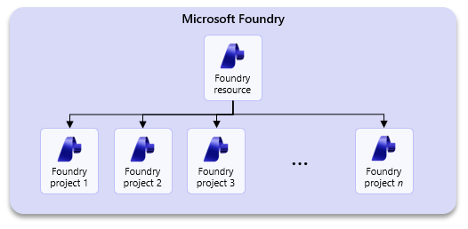
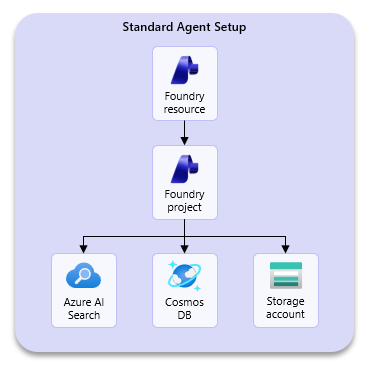

**Microsoft Foundry adoption across your organization**

Written by Alex Ruiz, Ayan Banerjee, Chris Tava

This guide presents options for planning adoption of Microsoft Foundry across your organization. It is important to define your target use cases and design your Foundry architecture accordingly.

The focus of this article is to assist customers in adopting Foundry for development purposes for the first time; there is a separate article targeted at production rollouts for agents and models created inside of Foundry.

**Prerequisites**

Before you begin adoption planning, confirm that you have:

- A target Azure subscription(s) and resource group(s) strategy for development and testing environments. This article does not cover production, which is tackled in its own separate article.
- Microsoft Entra ID groups (or equivalent identity groups) should be defined for administrators, project managers, and project users to ensure role-based access governance.
- Reviewed your data residency constraints and identified an initial region plan based on model and feature availability. Certain industries, such as healthcare or financial services, have strict compliance requirements for where data must reside and/or be processed. For details, see [feature availability across cloud regions](https://learn.microsoft.com/en-us/azure/foundry/reference/region-support), our [model deployment guide](https://learn.microsoft.com/en-us/azure/ai-services/openai/how-to/deployment-types), and our [data processing & privacy article](https://learn.microsoft.com/en-us/azure/foundry/responsible-ai/openai/data-privacy?tabs=azure-portal).
- Reviewed your organization’s security requirements for private networking, encryption, cloud access, and data isolation. It is recommended that your security teams are a part of Foundry adoption planning efforts.
- Familiarized yourself with the concepts of the [agent development lifecycle](https://learn.microsoft.com/en-us/azure/foundry/agents/concepts/development-lifecycle) for Microsoft Foundry.
- <!-- Added based on FSI review --> Defined your zero-trust and defense-in-depth requirements up front, including network segmentation, privileged access controls, immutable logging requirements, and customer-managed key lifecycle expectations for development and test environments.
- <!-- Added based on FSI review --> Identified any regulatory mappings you expect your Foundry deployment to support in non-production, such as PCI-DSS, APRA CPS 234, SOX, or GDPR, and the Azure Policy / auditing controls you will use to demonstrate adherence.

**How are customers adopting Foundry? What are they using it for?**

Across our customers, when it comes to artificial intelligence, we see two main adoptions across enterprises: Generative AI software-as-a-service tools (i.e. Copilot Studio) and customizable, enterprise-wide, cloud-based AI platforms (i.e. Microsoft Foundry).

Some customers want their users to create and consume agents in an easy-to-use tool, and CoPilot Studio squarely fits this need. Other customers lean more to the pro-code developer approach or have compliance or security restrictions that require more control and configurability over agentic development, and so they lean more on Microsoft Foundry.

These approaches tend to coexist, as organizations aim to leverage the full breadth of their employees’ capabilities while making AI widely accessible across the enterprise (we’ll explore the enterprise-wide AI platform later in this article).

In development scenarios, we are seeing Foundry primarily tackle 3 use cases:

1. **Playground-based experimentation:** first-time developers leverage the Playgrounds experience in Foundry to try out different models, prompts, and evaluations in the ideation phase of development.
2. **Model API Hosting:** seasoned developers feel more at home in their IDE of choice, and so platform administrators may provide policy-compliant model endpoints for developers to consume as they please.
3. **End-to-end AI pipelines:** developers may choose to build complete solutions with Foundry that take advantage of models, agents, evaluations tools, and content safety features.

The content of this article is geared toward (1) & (2), with a more robust article around complete production rollouts available elsewhere.

|  |
| --- |
| **TIP:** We highly recommend familiarizing yourself with the [agent development lifecycle in Microsoft Foundry](https://learn.microsoft.com/en-us/azure/foundry/agents/concepts/development-lifecycle) *before* proceeding with the remainder of the article. Concepts from the lifecycle will be addressed in later sections of the article when we cover observability, governance, and monitoring. |

**Microsoft Foundry adoption checklist**

Many customers find it useful to have an adoption checklist handy that outlines the important components of adopting a new technology platform. We’ve provided an adoption checklist below for you to use as a starting point:

|  |  |
| --- | --- |
|  | Define your environment boundaries across development, testing, and production. |
|  | Identify or assign ownership for each Foundry resource and project scope. Leverage the approaches to organizing Foundry section of this article to determine how your organization will adopt Foundry. |
|  | Identify any resource connection requirements for your Foundry projects. |
|  | Define your network configuration for Foundry based on the three recommended patterns presented in this article. Leverage infrastructure-as-code templates wherever possible. |
|  | Determine whether customer-managed keys are required by policy. This is an important consideration for highly regulated industries such as healthcare. |
|  | Define a model deployment strategy to ensure model capacity and that your organization remains compliant with any data residency or processing requirements. |
|  | Identify environment-wide policies that are required to apply to model and agent deployments – i.e. token and rate limit policies via APIM, Foundry guardrails, Azure Policies restricting certain model usage, etc. |
|  | Define role-based access control assignments for platform administrators, project managers, and project users. Root your assignments in the Microsoft best practice of least-privilege. |
|  | Determine your cost management strategy for tracking costs associated with Foundry, such as model, agent, and tool calling, or associate resources. |
|  | Enable monitoring capabilities to capture information related to your Foundry environment and the agents created there. |
|  | <!-- Added based on FSI review --> Define a zero-trust network architecture that uses deny-by-default segmentation, private endpoints for sensitive services, and explicit controls for east-west traffic to reduce lateral movement. |
|  | <!-- Added based on FSI review --> Establish your encryption key lifecycle process, including secure storage in Azure Key Vault or Managed HSM, rotation cadence, separation of duties, backup/recovery, and audit logging of key operations. |
|  | <!-- Added based on FSI review --> Configure privileged access management with Microsoft Entra Privileged Identity Management (PIM), multifactor authentication, and Conditional Access for administrative and high-impact actions. |
|  | <!-- Added based on FSI review --> Route platform, resource, and key management logs to centralized and immutable storage where required by policy, and define retention and review procedures. |
|  | <!-- Added based on FSI review --> Use Azure Policy and Microsoft Defender for Cloud to continuously validate compliance posture and identify drift from approved Foundry configurations. |
|  | <!-- Added based on FSI review --> Schedule recurring access reviews for privileged and project-scoped roles to support least-privilege and regulatory evidence requirements. |

We’ll start with the considerations to keep in mind for organizing projects inside Microsoft Foundry.

**Project setup considerations for adopting Foundry**

**What are Foundry Projects?**

Microsoft Foundry uses a Foundry account resource and Foundry project distinction for resource organization – like a parent / child relationship. The Foundry account resource provides the shared control plane, governance, and core AI capabilities such as models, services, and management for all associated Foundry projects. Foundry projects are designed to represent specific use cases for developers to work on. They’re containers to organize components such as agents or files for an application. While they inherit security settings from their parent Foundry resource, they can also implement their own access controls, resource connections, and other governance controls.

You can have many Foundry projects within a Foundry resource, as seen below:

**Approaches to organizing Foundry**

There are two perspectives to consider when approaching Foundry adoption: the enterprise-wide perspective and the department-level perspective.

**The “Enterprise-Wide” Perspective**

Many organizations gravitate towards viewing Foundry as their next generation AI platform, and leaders will naturally want to build a single, enterprise-wide AI platform around Foundry.

|  |
| --- |
| **TIP:** It is crucial to view Foundry as a *development* platform, not a *consumption* platform. It is acceptable and, in some cases, encouraged to pursue an enterprise-wide AI platform, where many users can log on and consume models and agents from one secure application. |

When tasked with an enterprise-wide adoption of Foundry, you will want to urge decision makers towards segmenting Foundry deployments across logical boundaries such as data domains or business units to ensure developer autonomy. See an example below:

To fulfill this “enterprise-wide” vision, you will have:

- **Department-level development environments:** Many Foundry resources, each for your different departments to use for development purposes,
- **Source Control & DevOps:** a process by which to check-in and promote your agentic code, or deploy your created agents across your development, test, and production environments,
- **API Governance:** a governance layer using Azure API Management, where rate limiting and token limit policies are applied to your models and agents APIs to control usage and costs.
- **Consumption Platform:** an application layer where users can consume your agents or models – such as CoPilot Studio, or your own custom application where you expose deployed models and agents.
- <!-- Added based on FSI review --> **Centralized security and compliance controls:** a shared governance layer for Azure Policy, Defender for Cloud, centralized logging, access reviews, and evidence collection so that each department-level Foundry deployment aligns to enterprise control objectives without removing local developer autonomy.

**The “Department-level” Perspective**

Let’s double click into the department-level approach to organizing Foundry. We’ve seen that organizations want to enable their departments or business groups to take advantage of emerging AI technologies such as agents to deliver impact by solving real business problems.

These developers need an environment where they can test models, build agents, and implement evaluations – either programmatically, or through a GUI – with a certain level of autonomy. Developer teams may need to access sensitive, department-level data or track costs specific to their budget; it is for this reason that we recommend segmenting your Foundry resources across these department-level boundaries, as seen below:

In this approach, you’ll give developers or developer teams their own projects inside of their respective Foundry resource and leverage shared connected resources – like storage and search indexes – across all those projects. This way, you’re keeping development scoped at the department-level, while still consolidating costs and maintaining a degree of collaboration.

|  |
| --- |
| **TIP:** You may be asking, “How many model deployments should I have inside each Foundry resource?”, “Is it recommended that users share model deployments?”, or “Should I give each user their own model deployment?” The answer here depends on your cost management/tracking requirements. |

**Department-level Enclaves**

We recognize that in some more restricted industries, such as healthcare or financial services, there are stricter requirements over the sensitivity and handling of data; these industries require more segmentation and more granular control over Foundry, and so we introduce the concept of the “department-level enclave”:

Here, each project receives their own respective resources, and users are *strictly* given role-based access to only their project and its supporting resources.

This approach involves trade-offs between compliance and operational complexity. While it enables greater resource segmentation and supports the governance of sensitive use cases with appropriate safeguards, it also increases environmental complexity and associated costs. There are also limitations to be aware of, [such as private endpoint sharing rules or maximum connections per project](https://learn.microsoft.com/en-us/azure/foundry/how-to/connections-add?tabs=foundry-portal), that are important to understand.

|  |
| --- |
| **TIP:** When it comes to setting up an enclave, carefully consider each use case before you create a new project. Ask questions such as:   - What kind of data will this project require? - Will de-identified data suffice? If not, does the data need to be stored separately? - Will indexed data need to be treated similarly? - Does this use case require robust logging and security of conversation threads?   If yes, then you may benefit from the enclave scenario. You may find that some resources can be shared, while others may not. |

<!-- Added based on FSI review -->
For financial services organizations, enclave-style segmentation is often the clearest way to align Foundry development with zero-trust expectations. In practice, this means not only separating projects and connected resources, but also using distinct subnets, NSGs, and private endpoints so that communication paths are explicit and minimized. Where broader departmental sharing is permitted, apply a deny-by-default posture for east-west traffic and only allow the flows needed for the specific use case. This helps reduce the risk of lateral movement while preserving the developer experience.

A key piece of the department-level approach is defining your organization’s model strategy. Certain models are only available in certain regions and in certain deployment configurations, which can impact where data is processed. It is important to understand model availability as well as model deployment configurations and plan accordingly. We will cover that later in this article.

**Securing your Foundry environment**

There are 3 primary ways to configure network security for your Foundry environment: *public*, *private*, and *hybrid*. The following section outlines each of these configurations and provides the underlying rationale, as well as infrastructure-as-code templates you can use to get started with your deployment.

|  |
| --- |
| **NOTE:** All of these configurations are variations of the [Standard Agent Setup](https://learn.microsoft.com/en-us/azure/foundry/agents/concepts/standard-agent-setup). If you are looking for a quick, easy-to-deploy Foundry configuration where all underlying components are managed by Microsoft, please see the basic agent setup. |

<!-- Added based on FSI review -->
For organizations with zero-trust mandates, treat the network choice not only as a connectivity decision, but as a segmentation and control decision. In practice, this means validating how each topology enforces identity-based access, minimizes public exposure, restricts east-west traffic, and supports centralized inspection, logging, and policy enforcement. Microsoft guidance on [Zero Trust Networking in Azure](https://learn.microsoft.com/en-us/azure/architecture/framework/security/networking) and [defense in depth with Azure](https://learn.microsoft.com/en-us/security/zero-trust/azure) should be used alongside the Foundry deployment patterns in this article.

The decision matrix below can help orient you towards which environment configuration is appropriate for your organization:

Deployment 1 – Standard Agent Setup (Public)

The public standard agent setup is the recommended configuration for customers looking for a complete Foundry deployment that includes all its ancillary Azure services but aren’t restricted by a requirement to deploy an environment with private networking.

With this deployment configuration, you’ll get the following resources deployed into your resource group:

- **Microsoft Foundry account & project:** parent resource and one project in which to work in by default.
- [**Foundry project capability host**](https://learn.microsoft.com/en-us/azure/foundry/agents/concepts/capability-hosts)**:** this sub-resource allows you to bring your own Azure resources and specifies resources for storing agent states such as conversation history, file uploads, and vector stores.
- **Azure Cosmos DB:** stores conversation history and threads.
- **Azure Storage:** stores data or files produced by your Agents, models, or Speech and Language services.
- **Azure AI Search:** stores embeddings and vector data.
- **Azure Key Vault:** stores encrypted keys that are used to connect across resources or APIs.

You can find an infrastructure-as-code template for this deployment configuration here: [*foundry-samples/infrastructure/infrastructure-setup-bicep/41-standard-agent-setup at main · microsoft-foundry/foundry-samples*](https://github.com/microsoft-foundry/foundry-samples/tree/main/infrastructure/infrastructure-setup-bicep/41-standard-agent-setup)

|  |
| --- |
| **NOTE:** You have the option to point the template to existing resources or have the template create new ones. In either case, these dependencies are customer-managed resources, not Microsoft-managed resources (as is the case in the basic agent setup). |

<!-- Added based on FSI review -->
For regulated organizations, this public pattern is typically best suited for lower-sensitivity development scenarios where public access is explicitly permitted by policy. Even in this model, apply defense-in-depth controls such as Conditional Access, multifactor authentication, strict RBAC, diagnostic logging, and Azure Policy guardrails. If your security posture requires private access to data services or explicit lateral movement controls, prefer the private pattern described next.

Deployment 2 – Standard Agent Setup (Private)

The private standard agent setup includes everything that the public standard agent setup includes, however all the resources are deployed in your own virtual network alongside private endpoints for each of the respective Azure resources. For customers in regulated industries such as healthcare or financial services, this is generally the recommended approach for deploying Foundry. There’s a more detailed article around setting up this environment found [here](https://learn.microsoft.com/en-us/azure/foundry/agents/how-to/virtual-networks).

|  |
| --- |
| **NOTE:** There is also support for a variation of this deployment but with a Microsoft-managed VNET, you can read more about that [here](https://learn.microsoft.com/en-us/azure/foundry/how-to/managed-virtual-network). |

An important callout for this private setup is the introduction of the Agents subnet – also called the delegated subnet – where your agents are deployed into. Although you may bring your own Azure resources, deployed agents (also called prompt-based agents) always get deployed into this subnet onto Microsoft-managed container applications where the agent runtimes are hosted. Two key points:

- Those container applications exist inside of the delegated subnet and are not seen or managed by customers.
- Customers are not charged for those container applications but are charged for the calls made to agents that run on those containers.

You can find a deployment template for this configuration here: [*foundry-samples/infrastructure/infrastructure-setup-bicep/15-private-network-standard-agent-setup at main · microsoft-foundry/foundry-samples*](https://github.com/microsoft-foundry/foundry-samples/tree/main/infrastructure/infrastructure-setup-bicep/15-private-network-standard-agent-setup)

There is also a modified version of this template that supports customer-managed keys.

|  |
| --- |
| **NOTE:** As agentic platform capabilities continue to mature, we are seeing customers move towards including Azure API Management as a core component of their Foundry deployments to manage model and agent APIs via policies. While there is a [deployment template of this private standard agent setup that includes APIM](https://github.com/microsoft-foundry/foundry-samples/tree/main/infrastructure/infrastructure-setup-bicep/16-private-network-standard-agent-apim-setup-preview), there are efforts underway to integrate APIM and Foundry via the [AI Gateway feature](https://learn.microsoft.com/en-us/azure/foundry/configuration/enable-ai-api-management-gateway-portal) (currently in public preview). |

<!-- Added based on FSI review -->
From a zero-trust perspective, the private pattern is usually the strongest baseline because it removes public exposure from dependent services and constrains access paths to approved network segments. To strengthen this pattern further:

- Use **NSGs with deny-by-default rules** and allow only required traffic between subnets and private endpoints.
- Consider **Azure Firewall** for centralized egress and east-west inspection, especially where multiple application tiers or enclave boundaries exist.
- Use **private endpoints** for sensitive services so access originates only from approved network locations.
- Where virtual machines or administrative jump infrastructure exist in the broader landing zone, use controls such as **Just-In-Time access** and centralized threat protection to reduce attack surface.
- Pair network controls with **identity controls** such as Microsoft Entra Conditional Access so that access is always authenticated, authorized, and monitored.

These controls help align the private setup with defense-in-depth expectations common in financial services.

Deployment 3 – Standard Agent Setup (Hybrid)

Lastly, there is one more deployment configuration for Foundry that is not often seen, but deserves mention: the hybrid configuration. The key differentiator with this configuration is the ability to switch between public and private Foundry access. Organizations will want to use this deployment configuration when they want:

- **Private backend resources:** Keep Azure AI Search, Cosmos DB, and Azure Storage behind private endpoints.
- **MCP Server integration:** Deploy MCP servers on the VNET that agents can access via a data proxy.
- **Private Foundry:** Full network isolation with secure access via VPN, ExpressRoute, or Bastion.
- **Optional public Foundry access:** Switch to public access for portal-based development if allowed by your organization’s security policy.

Organizations will want to avoid this configuration and defer to Deployment 2 – Standard Agent Setup (private) when they need:

- **Fully managed private networking:** Including managed VNET with Microsoft-managed private endpoints.
- **Compliance requirements:** Regulations that require a different private networking topology.

Below is a table that compares private deployment and hybrid deployments:

|  |  |  |  |
| --- | --- | --- | --- |
| Deployment 2 (Private) vs. Deployment 3 (Hybrid) | | | |
| Feature | Private | Hybrid – “Private” | Hybrid – “Public” |
| AI Services public access | Disabled | Disabled | Enabled |
| Foundry Portal access | Via VPN, ExpressRoute, or Bastion | Via VPN, ExpressRoute, or Bastion | Works directly |
| Backend resources | Private | Private | Private |
| Data Proxy | Configured | Configured | Configured |
| Secure connection required | Yes | Yes | No |

You can find a deployment template for this configuration here: [*foundry-samples/infrastructure/infrastructure-setup-bicep/19-hybrid-private-resources-agent-setup at main · microsoft-foundry/foundry-samples*](https://github.com/microsoft-foundry/foundry-samples/tree/main/infrastructure/infrastructure-setup-bicep/19-hybrid-private-resources-agent-setup)

<!-- Added based on FSI review -->
For FSI customers, the hybrid pattern should be adopted cautiously and only where the temporary or controlled use of public Foundry access is explicitly approved. If you enable the public mode of the hybrid setup, ensure that Conditional Access, MFA, strict RBAC, and comprehensive diagnostic logging are in place, and verify that the ability to switch to public access does not conflict with your internal control framework.

Define your model strategy

In a constantly evolving space like AI, it is important for an organization to define its model strategy. Model lifecycle stages or regional capacity constraints can affect the models you choose to integrate into your applications. A viable model strategy should address three key areas:

1. **Model lifecycle:** models are continuously refreshed with newer, more capable models. As a part of this process, model providers may deprecate and retire older models, requiring application updates to use newer model versions. It is important to understand the model lifecycle stages, and how [Foundry models](https://learn.microsoft.com/en-us/azure/foundry/concepts/model-lifecycle-retirement) and [Azure Open AI models](https://learn.microsoft.com/en-us/azure/foundry/openai/concepts/model-retirements?tabs=text) are deprecated and retired.
2. **Deployment types:** There are different [deployment offerings](https://learn.microsoft.com/en-us/azure/foundry/foundry-models/concepts/deployment-types), which impact where your prompt inputs are processed geographically. For customers in regulated industries, there may be a requirement for [data processing](https://learn.microsoft.com/en-us/azure/foundry/responsible-ai/openai/data-privacy?tabs=azure-portal) to occur within a geographical region.
3. **Region availability:** Along the same lines as deployment types, it is important when selecting a model to verify which regions are supported for the model your team may be evaluating. Regional support can vary depending on available capacity, and not all models get rolled out to all regions.

<!-- Added based on FSI review -->
In addition to model selection, define how model access will be governed and monitored. Many organizations place model and agent APIs behind Azure API Management to apply token limits, rate limits, and consistent access policies. This can help align model consumption with cost controls, segmentation strategy, and auditability expectations.

<!-- Added based on FSI review -->
**Encryption key lifecycle and access governance**

For organizations that require customer-managed keys, the key decision is not only whether CMK is enabled, but how the full key lifecycle is operated. Recommended practices include:

- Store keys in **Azure Key Vault** or **Managed HSM**, depending on your cryptographic and compliance requirements.
- Enable **soft delete** and **purge protection** on vaults.
- Use **RBAC** and separation of duties so that key administrators, platform administrators, and application operators do not share unnecessary privileges.
- Define a **rotation policy** aligned to your internal standards or applicable regulations, and validate that dependent services continue operating as expected after rotation.
- Enable logging for **key operations** such as create, rotate, revoke, delete, and access events.
- Define and test **backup and recovery** procedures for keys and vault configuration.

For more information, see [Azure Key Vault key lifecycle management](https://learn.microsoft.com/en-us/azure/key-vault/general/key-lifecycle) and [PCI DSS on Azure](https://learn.microsoft.com/en-us/azure/compliance/offerings/offering-pci-dss).

<!-- Added based on FSI review -->
**Audit logging, privileged access, and continuous compliance**

As you move from ad hoc experimentation to a governed development platform, observability should include both operational telemetry and control evidence. At a minimum, consider the following:

- Configure **Azure Activity Logs**, resource logs, and diagnostic settings for Foundry-connected services.
- Route logs to a centralized platform such as **Azure Monitor** / **Log Analytics**, and where required, archive them to **immutable storage** using capabilities such as legal hold or equivalent write-once retention controls.
- Use **Microsoft Entra Privileged Identity Management (PIM)** for just-in-time administrative access.
- Require **MFA** and **Conditional Access** for privileged roles and other high-impact operations.
- Schedule **access reviews** for privileged and project-scoped access to validate least privilege over time.
- Use **Azure Policy** and **Microsoft Defender for Cloud** for continuous compliance checks, posture visibility, and drift detection across Foundry environments.
- Where centralized security operations are in place, integrate logs and alerts with your SIEM for ongoing monitoring and evidence collection.

For more information, see [Privileged access management with PIM](https://learn.microsoft.com/en-us/azure/active-directory/privileged-identity-management/pim-configure), [Azure Activity Log](https://learn.microsoft.com/en-us/azure/azure-monitor/essentials/activity-log), and [Azure Policy overview](https://learn.microsoft.com/en-us/azure/governance/policy/overview).