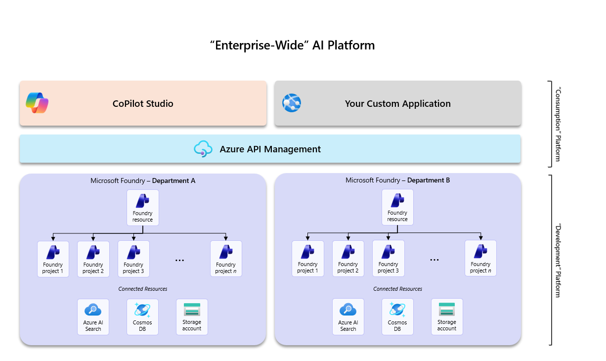
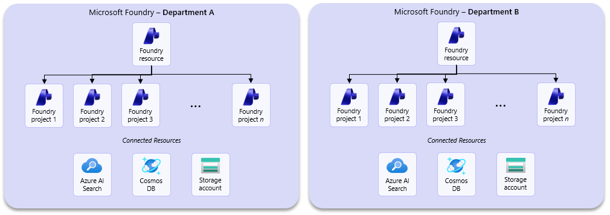
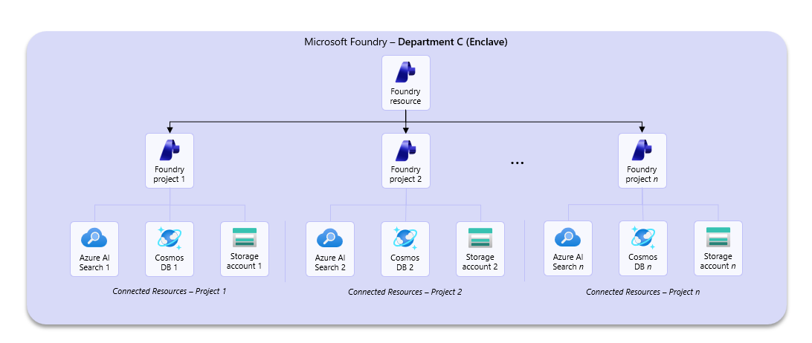
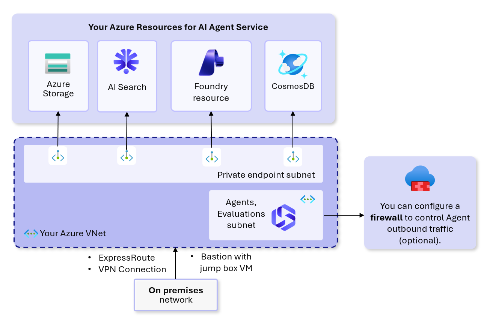

**Microsoft Foundry adoption across your organization**

Written by Alex Ruiz, Ayan Banerjee, Chris Tava

This guide presents options for planning adoption of Microsoft Foundry across your organization. It is important to define your target use cases and design your Foundry architecture accordingly.

The focus of this article is to assist customers in adopting Foundry for development purposes for the first time; there is a separate article targeted at production rollouts for agents and models created inside of Foundry.

**Prerequisites**

Before you begin adoption planning, confirm that you have:

- A target Azure subscription(s) and resource group(s) strategy for development and testing environments. This article does not cover production, which is tackled in its own separate article.
- Microsoft Entra ID groups (or equivalent identity groups) should be defined for administrators, project managers, and project users to ensure role-based access governance.
- Reviewed your data residency constraints and identified an initial region plan based on model and feature availability. Certain industries, such as healthcare or financial services, have strict compliance requirements for where data must reside and/or be processed. For details, see [feature availability across cloud regions](https://learn.microsoft.com/en-us/azure/foundry/reference/region-support), our [model deployment guide](https://learn.microsoft.com/en-us/azure/ai-services/openai/how-to/deployment-types), and our [data processing & privacy article](https://learn.microsoft.com/en-us/azure/foundry/responsible-ai/openai/data-privacy?tabs=azure-portal).
- Reviewed your organization’s security requirements for private networking, encryption, cloud access, and data isolation. It is recommended that your security teams are a part of Foundry adoption planning efforts.
- Familiarized yourself with the concepts of the [agent development lifecycle](https://learn.microsoft.com/en-us/azure/foundry/agents/concepts/development-lifecycle) for Microsoft Foundry.

**How are customers adopting Foundry? What are they using it for?**

Across our customers, when it comes to artificial intelligence, we see two main adoptions across enterprises: Generative AI software-as-a-service tools (i.e. Copilot Studio) and customizable, enterprise-wide, cloud-based AI platforms (i.e. Microsoft Foundry).

Some customers want their users to create and consume agents in an easy-to-use tool, and CoPilot Studio squarely fits this need. Other customers lean more to the pro-code developer approach or have compliance or security restrictions that require more control and configurability over agentic development, and so they lean more on Microsoft Foundry.

These approaches tend to coexist, as organizations aim to leverage the full breadth of their employees’ capabilities while making AI widely accessible across the enterprise (we’ll explore the enterprise-wide AI platform later in this article).

In development scenarios, we are seeing Foundry primarily tackle 3 use cases:

1. **Playground-based experimentation:** first-time developers leverage the Playgrounds experience in Foundry to try out different models, prompts, and evaluations in the ideation phase of development.
2. **Model API Hosting:** seasoned developers feel more at home in their IDE of choice, and so platform administrators may provide policy-compliant model endpoints for developers to consume as they please.
3. **End-to-end AI pipelines:** developers may choose to build complete solutions with Foundry that take advantage of models, agents, evaluations tools, and content safety features.

The content of this article is geared toward (1) & (2), with a more robust article around complete production rollouts available elsewhere.

|  |
| --- |
| **TIP:** We highly recommend familiarizing yourself with the [agent development lifecycle in Microsoft Foundry](https://learn.microsoft.com/en-us/azure/foundry/agents/concepts/development-lifecycle) *before* proceeding with the remainder of the article. Concepts from the lifecycle will be addressed in later sections of the article when we cover observability, governance, and monitoring. |

**Microsoft Foundry adoption checklist**

Many customers find it useful to have an adoption checklist handy that outlines the important components of adopting a new technology platform. We’ve provided an adoption checklist below for you to use as a starting point:

|  |  |
| --- | --- |
|  | Define your environment boundaries across development, testing, and production. |
|  | Identify or assign ownership for each Foundry resource and project scope. Leverage the approaches to organizing Foundry section of this article to determine how your organization will adopt Foundry. |
|  | Identify any resource connection requirements for your Foundry projects. |
|  | Define your network configuration for Foundry based on the three recommended patterns presented in this article. Leverage infrastructure-as-code templates wherever possible. |
|  | Determine whether customer-managed keys are required by policy. This is an important consideration for highly regulated industries such as healthcare. |
|  | Define a model deployment strategy to ensure model capacity and that your organization remains compliant with any data residency or processing requirements. |
|  | Identify environment-wide policies that are required to apply to model and agent deployments – i.e. token and rate limit policies via APIM, Foundry guardrails, Azure Policies restricting certain model usage, etc. |
|  | Define role-based access control assignments for platform administrators, project managers, and project users. Root your assignments in the Microsoft best practice of least-privilege. |
|  | Determine your cost management strategy for tracking costs associated with Foundry, such as model, agent, and tool calling, or associate resources. |
|  | Enable monitoring capabilities to capture information related to your Foundry environment and the agents created there. |
|  | <!-- Added based on ENGINEERING review --> Define your GitOps boundary for Foundry: identify which artifacts are managed as infrastructure, which are managed as data-plane definitions through SDK/REST automation, and which portal actions are allowed only for experimentation or break-glass use. |
|  | <!-- Added based on ENGINEERING review --> Define a CI/CD and release engineering process for prompts, agent configurations, tool/MCP contracts, connections, model bindings, and evaluations, including immutable versioning and rollback targets. |
|  | <!-- Added based on ENGINEERING review --> Define a developer workflow for local testing, sandbox projects, mocked tools, isolated Azure-backed test resources, and cloud-backed evaluation gates. |
|  | <!-- Added based on ENGINEERING review --> Define operational runbooks for quota exhaustion, model retirement, downstream tool outages, and emergency failback. |
|  | <!-- Added based on ENGINEERING review --> Define minimum audit evidence for release provenance, including commit SHA, pipeline run, approvers, evaluation results, active version, and approved rollback target. |

We’ll start with the considerations to keep in mind for organizing projects inside Microsoft Foundry.

**Project setup considerations for adopting Foundry**

**What are Foundry Projects?**

Microsoft Foundry uses a Foundry account resource and Foundry project distinction for resource organization – like a parent / child relationship. The Foundry account resource provides the shared control plane, governance, and core AI capabilities such as models, services, and management for all associated Foundry projects. Foundry projects are designed to represent specific use cases for developers to work on. They’re containers to organize components such as agents or files for an application. While they inherit security settings from their parent Foundry resource, they can also implement their own access controls, resource connections, and other governance controls.

You can have many Foundry projects within a Foundry resource, as seen below:

**Approaches to organizing Foundry**

There are two perspectives to consider when approaching Foundry adoption: the enterprise-wide perspective and the department-level perspective.

**The “Enterprise-Wide” Perspective**

Many organizations gravitate towards viewing Foundry as their next generation AI platform, and leaders will naturally want to build a single, enterprise-wide AI platform around Foundry.

|  |
| --- |
| **TIP:** It is crucial to view Foundry as a *development* platform, not a *consumption* platform. It is acceptable and, in some cases, encouraged to pursue an enterprise-wide AI platform, where many users can log on and consume models and agents from one secure application. |

When tasked with an enterprise-wide adoption of Foundry, you will want to urge decision makers towards segmenting Foundry deployments across logical boundaries such as data domains or business units to ensure developer autonomy. See an example below:

To fulfill this “enterprise-wide” vision, you will have:

- **Department-level development environments:** Many Foundry resources, each for your different departments to use for development purposes,
- **Source Control & DevOps:** a process by which to check-in and promote your agentic code, or deploy your created agents across your development, test, and production environments,
- **API Governance:** a governance layer using Azure API Management, where rate limiting and token limit policies are applied to your models and agents APIs to control usage and costs.
- **Consumption Platform:** an application layer where users can consume your agents or models – such as CoPilot Studio, or your own custom application where you expose deployed models and agents.

<!-- Added based on ENGINEERING review -->
For engineering-led platform rollouts, it is helpful to think about Foundry adoption across **two deployment planes**:

1. **Control plane / infrastructure** – Foundry account and projects, networking, model deployments, connections, RBAC, diagnostic settings, Log Analytics, Application Insights, APIM, and policy assignments.
2. **Data plane / agent artifacts** – agent definitions and versions, prompts and instructions, tool bindings, evaluation datasets and configurations, and certain knowledge or toolbox objects that are not managed as ARM resources.

This distinction is important because organizations typically use **infrastructure-as-code** for the control plane, and **SDK / REST / post-provision automation** for data-plane artifacts that are not fully ARM-manageable. See [Authentication and authorization in Microsoft Foundry](https://learn.microsoft.com/azure/foundry/concepts/authentication-authorization-foundry#control-plane-and-data-plane).

**The “Department-level” Perspective**

Let’s double click into the department-level approach to organizing Foundry. We’ve seen that organizations want to enable their departments or business groups to take advantage of emerging AI technologies such as agents to deliver impact by solving real business problems.

These developers need an environment where they can test models, build agents, and implement evaluations – either programmatically, or through a GUI – with a certain level of autonomy. Developer teams may need to access sensitive, department-level data or track costs specific to their budget; it is for this reason that we recommend segmenting your Foundry resources across these department-level boundaries, as seen below:

In this approach, you’ll give developers or developer teams their own projects inside of their respective Foundry resource and leverage shared connected resources – like storage and search indexes – across all those projects. This way, you’re keeping development scoped at the department-level, while still consolidating costs and maintaining a degree of collaboration.

|  |
| --- |
| **TIP:** You may be asking, “How many model deployments should I have inside each Foundry resource?”, “Is it recommended that users share model deployments?”, or “Should I give each user their own model deployment?” The answer here depends on your cost management/tracking requirements. |

<!-- Added based on ENGINEERING review -->
For engineering teams, this department-level pattern also works well for establishing a **sandbox strategy**:

- **Personal or team dev projects** for iterative experimentation with prompts, tools, and evaluations,
- **Shared dev / test / UAT projects** for integration, RBAC validation, network validation, and release qualification,
- **Production environments** with stricter write controls, pinned versions, and formal promotion pipelines.

This allows developers to move quickly without creating uncontrolled drift in shared environments.

**Department-level Enclaves**

We recognize that in some more restricted industries, such as healthcare or financial services, there are stricter requirements over the sensitivity and handling of data; these industries require more segmentation and more granular control over Foundry, and so we introduce the concept of the “department-level enclave”:

Here, each project receives their own respective resources, and users are *strictly* given role-based access to only their project and its supporting resources.

This approach involves trade-offs between compliance and operational complexity. While it enables greater resource segmentation and supports the governance of sensitive use cases with appropriate safeguards, it also increases environmental complexity and associated costs. There are also limitations to be aware of, [such as private endpoint sharing rules or maximum connections per project](https://learn.microsoft.com/en-us/azure/foundry/how-to/connections-add?tabs=foundry-portal), that are important to understand.

|  |
| --- |
| **TIP:** When it comes to setting up an enclave, carefully consider each use case before you create a new project. Ask questions such as:   - What kind of data will this project require? - Will de-identified data suffice? If not, does the data need to be stored separately? - Will indexed data need to be treated similarly? - Does this use case require robust logging and security of conversation threads?   If yes, then you may benefit from the enclave scenario. You may find that some resources can be shared, while others may not. |

A key piece of the department-level approach is defining your organization’s model strategy. Certain models are only available in certain regions and in certain deployment configurations, which can impact where data is processed. It is important to understand model availability as well as model deployment configurations and plan accordingly. We will cover that later in this article.

**Securing your Foundry environment**

There are 3 primary ways to configure network security for your Foundry environment: *public*, *private*, and *hybrid*. The following section outlines each of these configurations and provides the underlying rationale, as well as infrastructure-as-code templates you can use to get started with your deployment.

|  |
| --- |
| **NOTE:** All of these configurations are variations of the [Standard Agent Setup](https://learn.microsoft.com/en-us/azure/foundry/agents/concepts/standard-agent-setup). If you are looking for a quick, easy-to-deploy Foundry configuration where all underlying components are managed by Microsoft, please see the basic agent setup. |

The decision matrix below can help orient you towards which environment configuration is appropriate for your organization:

Deployment 1 – Standard Agent Setup (Public)

The public standard agent setup is the recommended configuration for customers looking for a complete Foundry deployment that includes all its ancillary Azure services but aren’t restricted by a requirement to deploy an environment with private networking.

With this deployment configuration, you’ll get the following resources deployed into your resource group:

- **Microsoft Foundry account & project:** parent resource and one project in which to work in by default.
- [**Foundry project capability host**](https://learn.microsoft.com/en-us/azure/foundry/agents/concepts/capability-hosts)**:** this sub-resource allows you to bring your own Azure resources and specifies resources for storing agent states such as conversation history, file uploads, and vector stores.
- **Azure Cosmos DB:** stores conversation history and threads.
- **Azure Storage:** stores data or files produced by your Agents, models, or Speech and Language services.
- **Azure AI Search:** stores embeddings and vector data.
- **Azure Key Vault:** stores encrypted keys that are used to connect across resources or APIs.

You can find an infrastructure-as-code template for this deployment configuration here: [*foundry-samples/infrastructure/infrastructure-setup-bicep/41-standard-agent-setup at main · microsoft-foundry/foundry-samples*](https://github.com/microsoft-foundry/foundry-samples/tree/main/infrastructure/infrastructure-setup-bicep/41-standard-agent-setup)

|  |
| --- |
| **NOTE:** You have the option to point the template to existing resources or have the template create new ones. In either case, these dependencies are customer-managed resources, not Microsoft-managed resources (as is the case in the basic agent setup). |

Deployment 2 – Standard Agent Setup (Private)

The private standard agent setup includes everything that the public standard agent setup includes, however all the resources are deployed in your own virtual network alongside private endpoints for each of the respective Azure resources. For customers in regulated industries such as healthcare or financial services, this is generally the recommended approach for deploying Foundry. There’s a more detailed article around setting up this environment found [here](https://learn.microsoft.com/en-us/azure/foundry/agents/how-to/virtual-networks).

|  |
| --- |
| **NOTE:** There is also support for a variation of this deployment but with a Microsoft-managed VNET, you can read more about that [here](https://learn.microsoft.com/en-us/azure/foundry/how-to/managed-virtual-network). |

An important callout for this private setup is the introduction of the Agents subnet – also called the delegated subnet – where your agents are deployed into. Although you may bring your own Azure resources, deployed agents (also called prompt-based agents) always get deployed into this subnet onto Microsoft-managed container applications where the agent runtimes are hosted. Two key points:

- Those container applications exist inside of the delegated subnet and are not seen or managed by customers.
- Customers are not charged for those container applications but are charged for the calls made to agents that run on those containers.

You can find a deployment template for this configuration here: [*foundry-samples/infrastructure/infrastructure-setup-bicep/15-private-network-standard-agent-setup at main · microsoft-foundry/foundry-samples*](https://github.com/microsoft-foundry/foundry-samples/tree/main/infrastructure/infrastructure-setup-bicep/15-private-network-standard-agent-setup)

There is also a modified version of this template that supports customer-managed keys.

|  |
| --- |
| **NOTE:** As agentic platform capabilities continue to mature, we are seeing customers move towards including Azure API Management as a core component of their Foundry deployments to manage model and agent APIs via policies. While there is a [deployment template of this private standard agent setup that includes APIM](https://github.com/microsoft-foundry/foundry-samples/tree/main/infrastructure/infrastructure-setup-bicep/16-private-network-standard-agent-apim-setup-preview), there are efforts underway to integrate APIM and Foundry via the [AI Gateway feature](https://learn.microsoft.com/en-us/azure/foundry/configuration/enable-ai-api-management-gateway-portal) (currently in public preview). |

<!-- Added based on ENGINEERING review -->
From a platform engineering standpoint, choose one of these topologies as your **enterprise default** and make exceptions explicit. In many engineering organizations with stronger governance requirements, the default is typically the **private** pattern, with public or hybrid setups reserved for approved exceptions. This improves repeatability for networking, diagnostics, DNS, private endpoints, and operational support. See [Set up private networking for Foundry Agent Service](https://learn.microsoft.com/azure/foundry/agents/how-to/virtual-networks).

Deployment 3 – Standard Agent Setup (Hybrid)

Lastly, there is one more deployment configuration for Foundry that is not often seen, but deserves mention: the hybrid configuration. The key differentiator with this configuration is the ability to switch between public and private Foundry access. Organizations will want to use this deployment configuration when they want:

- **Private backend resources:** Keep Azure AI Search, Cosmos DB, and Azure Storage behind private endpoints.
- **MCP Server integration:** Deploy MCP servers on the VNET that agents can access via a data proxy.
- **Private Foundry:** Full network isolation with secure access via VPN, ExpressRoute, or Bastion.
- **Optional public Foundry access:** Switch to public access for portal-based development if allowed by your organization’s security policy.

Organizations will want to avoid this configuration and defer to Deployment 2 – Standard Agent Setup (private) when they need:

- **Fully managed private networking:** Including managed VNET with Microsoft-managed private endpoints.
- **Compliance requirements:** Regulations that require a different private networking topology.

Below is a table that compares private deployment and hybrid deployments:

|  |  |  |  |
| --- | --- | --- | --- |
| Deployment 2 (Private) vs. Deployment 3 (Hybrid) | | | |
| Feature | Private | Hybrid – “Private” | Hybrid – “Public” |
| AI Services public access | Disabled | Disabled | Enabled |
| Foundry Portal access | Via VPN, ExpressRoute, or Bastion | Via VPN, ExpressRoute, or Bastion | Works directly |
| Backend resources | Private | Private | Private |
| Data Proxy | Configured | Configured | Configured |
| Secure connection required | Yes | Yes | No |

You can find a deployment template for this configuration here: [*foundry-samples/infrastructure/infrastructure-setup-bicep/19-hybrid-private-resources-agent-setup at main · microsoft-foundry/foundry-samples*](https://github.com/microsoft-foundry/foundry-samples/tree/main/infrastructure/infrastructure-setup-bicep/19-hybrid-private-resources-agent-setup)

Define your model strategy

In a constantly evolving space like AI, it is important for an organization to define its model strategy. Model lifecycle stages or regional capacity constraints can affect the models you choose to integrate into your applications. A viable model strategy should address three key areas:

1. **Model lifecycle:** models are continuously refreshed with newer, more capable models. As a part of this process, model providers may deprecate and retire older models, requiring application updates to use newer model versions. It is important to understand the model lifecycle stages, and how [Foundry models](https://learn.microsoft.com/en-us/azure/foundry/concepts/model-lifecycle-retirement) and [Azure Open AI models](https://learn.microsoft.com/en-us/azure/foundry/openai/concepts/model-retirements?tabs=text) are deprecated and retired.
2. **Deployment types:** There are different [deployment offerings](https://learn.microsoft.com/en-us/azure/foundry/foundry-models/concepts/deployment-types), which impact where your prompt inputs are processed geographically. For customers in regulated industries, there may be a requirement for [data processing](https://learn.microsoft.com/en-us/azure/foundry/responsible-ai/openai/data-privacy?tabs=azure-portal) to occur within a geographical region.
3. **Region availability:** Along the same lines as deployment types, it is important when selecting a model to verify which regions are supported for the model your team may be evaluating. Regional support can vary depending on available capacity, and not all models get rolled out to all regions.

<!-- Added based on ENGINEERING review -->
From an engineering perspective, your model strategy should also define:

- **Approved deployment aliases per environment** rather than hardcoding raw model names into agent definitions,
- **Successor models for critical workloads** to address retirement or emergency retirement events,
- **Alternate deployments** for capacity or quota-related failover where your compliance requirements allow,
- **Release gates for model swaps**, since changing a model binding should be treated as a releasable change requiring regression evaluations.

For quota and capacity planning, see [Azure OpenAI in Microsoft Foundry Models quotas and limits](https://learn.microsoft.com/azure/foundry/openai/quotas-limits) and [Foundry Agent Service limits, quotas, and regional support](https://learn.microsoft.com/azure/foundry/agents/concepts/limits-quotas-regions). For model lifecycle and emergency retirement considerations, see [Microsoft Foundry Models lifecycle and support policy](https://learn.microsoft.com/azure/foundry/openai/concepts/model-retirements) and [Model versions in Microsoft Foundry Models](https://learn.microsoft.com/azure/foundry/foundry-models/concepts/model-versions).

Planning your user access strategy for Foundry

<!-- Added based on ENGINEERING review -->
A practical access strategy for Foundry should distinguish between **platform administration**, **project management**, **development**, and **operational review** responsibilities. At minimum, customers should:

- Assign RBAC to **groups**, not individual users, wherever possible.
- Separate permissions for **platform baseline management** (networking, policies, diagnostics, RBAC) from **project-level development** (agents, evaluations, files, connections where appropriate).
- Restrict direct write access in **production** so promotions occur through approved pipelines rather than ad hoc portal edits.
- Provide operational teams with read access to **Application Insights**, **Log Analytics**, and relevant diagnostic destinations so they can investigate incidents and review evaluation and runtime evidence.

<!-- Added based on ENGINEERING review -->
For engineering organizations, a common model is:

- **Platform administrators** manage Foundry accounts, model deployment governance, networking, private endpoints, policy assignments, diagnostic settings, and shared monitoring resources.
- **Project managers / technical leads** govern project structure, approve releases, and coordinate access to connected resources.
- **Project users / developers** build and test agents, prompts, tools, and evaluations within their assigned project scopes.
- **Operations / SRE reviewers** consume logs, traces, dashboards, and release manifests, but do not necessarily need broad write access inside Foundry.

<!-- Added based on ENGINEERING review -->
Production should generally avoid “always use latest” behaviors for critical endpoints. Prefer pinned, approved versions and pipeline-driven promotions so access control and approval workflows remain auditable.

Adopting a cost management strategy in Foundry

<!-- Added based on ENGINEERING review -->
A cost management strategy for Foundry should account for more than model tokens alone. Development and test environments often accumulate spend across:

- model deployments and capacity reservations,
- token usage for prompts, tool calls, and evaluations,
- storage, search, and Cosmos DB usage for capability hosts,
- Application Insights and Log Analytics ingestion and retention,
- APIM and networking components used for governance.

<!-- Added based on ENGINEERING review -->
To improve cost visibility and accountability:

- Segment Foundry resources at boundaries where you need separate cost attribution.
- Standardize tagging for environment, department, owner, use case, and platform lineage.
- Route model and agent access through governance layers such as APIM where token and rate-limit policies can help prevent runaway consumption.
- Track evaluation usage separately from interactive development usage where possible; repeated regressions and large golden datasets can create meaningful nonproduction spend.

<!-- Added based on ENGINEERING review -->
Engineering teams should also include **capacity headroom** as part of release readiness. For critical agents, identify the approved primary and alternate model deployments ahead of time so quota exhaustion or regional capacity issues can be handled operationally rather than improvisationally.

Governance & monitoring strategy in Foundry

While the scope of this guide is limited to development workloads (and not production), we recognize the need for platform governance and monitoring strategies in development environments. Platform administrators may want to:

- Govern API endpoints for models or agents in development,
- Control access to certain models available in the Foundry catalog,
- Monitor usage or operations of agents deployed for testing in dev / test / UAT environments,
- Verify that logging configurations satisfy organizational requirements.

The list above may not be exhaustive but is a well-rounded set of asks that we commonly see customers looking for guidance around. We’ve gathered information around these four areas, which you can find below.

Model & Agentic API Governance via an AI Gateway

<!-- Added based on ENGINEERING review -->
For engineering organizations, API governance is often the layer that turns a collection of Foundry resources into a managed platform. Azure API Management can provide:

- token and rate limit policies for model and agent endpoints,
- a stable consumer-facing endpoint while backend versions change,
- a place to apply authentication, header, and routing standards,
- a practical failback layer when you need to redirect traffic to an alternate model deployment, MCP/tool backend revision, or separately published agent endpoint.

<!-- Added based on ENGINEERING review -->
When using APIM or a similar gateway, define whether it is the mandatory access path for:
- production model endpoints,
- published agent applications,
- department-shared tools and MCP servers,
- canary or blue/green routing patterns implemented outside Foundry-native traffic controls.

Control model access with Azure Policy

Certain organizations in more restricted industries may seek to govern or restrict the deployment of specific models in the Microsoft Foundry model catalog. Microsoft provides built-in Azure policies for governing both [model deployments](https://learn.microsoft.com/en-us/azure/foundry/how-to/model-deployment-policy?tabs=cli) as well as [Foundry tools](https://learn.microsoft.com/en-us/azure/ai-services/policy-reference?context=/azure/foundry/context/context) to give customers control over which models and tools developers can use.

|  |
| --- |
| **NOTE:** These Azure Policies *do not* make any UI changes inside of the Microsoft Foundry portal; users will still be able to see model and tool cards in the catalog but will not be able to deploy them. Be sure to communicate to your users that you’ve put policies in place that restrict usage of certain models or tools! |

Monitoring your deployed agents with Foundry’s observability suite

A large part of the agent development cycle focuses on developing agent observability. Observability refers to the ability to monitor, understand, and troubleshoot AI agents throughout their lifecycle. There are three core capabilities that make up the Foundry observability suite:

- 1. **Evaluations:** [Evaluators](https://learn.microsoft.com/en-us/azure/foundry/observability/how-to/evaluate-agent) measure the quality, safety, and reliability of agentic responses throughout development and into production. Different agents may use different evaluators depending on their specific purpose; however, some organizations may require a set of baseline evaluators across all agents – be sure to check with your AI platform or security administrator.
  2. **Monitoring:** Microsoft Foundry provides [real-time dashboards](https://learn.microsoft.com/en-us/azure/foundry/observability/how-to/how-to-monitor-agents-dashboard?tabs=python) for tracking operational metrics, token consumption, latency, error rates, and quality scores. You can set up alerts when outputs fail quality thresholds or produce harmful content. We also provide a [fleet monitoring guide](https://learn.microsoft.com/en-us/azure/foundry/control-plane/monitoring-across-fleet) for platform administrators who are looking to monitor agents across many Foundry resources, as well as a guide for [performing lifecycle operations at scale](https://learn.microsoft.com/en-us/azure/foundry/control-plane/how-to-manage-agents).
  3. **Tracing:** [Tracing](https://learn.microsoft.com/en-us/azure/foundry/observability/concepts/trace-agent-concept) offers insight into the execution flow of agentic systems, particularly into API calls, tool invocations, agentic decisions, and inter-service dependencies. It’s a key piece of troubleshooting or debugging your developers may need to do as they refine their agentic system.
  4. **Guardrails:**

Alongside enablement of these features across all agent development efforts, it is important for developer teams to understand and implement red teaming as a pre-requisite to shipping any agentic system live into production. AI Red Teaming focuses on simulations or testing by both human users and AI Red Teaming agents to uncover security vulnerabilities or probe for novel risks in an agentic system.

|  |
| --- |
| **TIP:** Microsoft has released a guide for developer teams to familiarize themselves not only with red teaming as a concept, but also how to implement red teaming using Microsoft Foundry’s [AI Red Teaming agent](https://learn.microsoft.com/en-us/azure/foundry/concepts/ai-red-teaming-agent). |

<!-- Added based on ENGINEERING review -->
For engineering teams, observability should be tied directly to **quality gates and release controls**. Recommended practices include:

- Maintain **golden datasets** for functional, tool-usage, and safety/compliance scenarios.
- Run **automated regression evaluations** whenever prompts, agent configuration, model bindings, tool contracts, or orchestration logic change.
- Use **dimension-specific pass/fail thresholds** rather than a single blended score.
- Compare candidate versions not just against absolute thresholds, but also against the **current approved baseline**.
- Use **trace-based evaluations** on realistic traffic where possible, especially during canary or limited rollout stages.

See [Run evaluations in the cloud by using the Microsoft Foundry SDK](https://learn.microsoft.com/azure/foundry/how-to/develop/cloud-evaluation), [Run evaluations from the Microsoft Foundry portal](https://learn.microsoft.com/azure/foundry/how-to/evaluate-generative-ai-app), and [Convert agent traces into evaluation datasets](https://learn.microsoft.com/azure/foundry/observability/how-to/traces-to-dataset).

<!-- Added based on ENGINEERING review -->
Cloud evaluation results are stored in the Foundry project and can be correlated with Application Insights when connected. In practice, engineering teams usually use:
- **Foundry project history** for evaluation runs, reports, and versioned datasets,
- **Application Insights / Log Analytics** for traces and runtime evidence,
- **Git and the CI/CD system** for approval records, threshold definitions, and rollback targets.

<!-- Added based on ENGINEERING review -->
When releasing changes, prefer **immutable agent versions** and rollback by routing traffic back to the last known-good version instead of editing in place. Microsoft documents version immutability and version-targeted requests as a core part of the [agent development lifecycle](https://learn.microsoft.com/azure/foundry/agents/concepts/development-lifecycle).

<!-- Added based on ENGINEERING review -->
**Supported release topology and rollback patterns**

The rollout strategy you use should reflect the type of Foundry asset you are deploying:

- **Prompt-based agents / stable agent endpoints:** use **pinned versions** in production. The stable endpoint supports “latest” or a specific pinned version, but does **not** support traffic splitting. See [Configure and share your agent](https://learn.microsoft.com/azure/foundry/agents/how-to/configure-agent).
- **Hosted agents:** use immutable versions with **weighted rollout** for canary or blue/green patterns where appropriate. See [What are hosted agents?](https://learn.microsoft.com/azure/foundry/agents/concepts/hosted-agents#platform-details).
- **Published Agent Applications:** current behavior is effectively **one active deployment at a time**, with 100% of traffic routed to that deployment. See [Publish your agent as an Agent Application](https://learn.microsoft.com/azure/foundry/agents/how-to/agent-applications).

<!-- Added based on ENGINEERING review -->
As a result:
- For **prompt agents**, emulate rings using separate environments or gateway-based routing rather than expecting native weighted traffic splitting on a single stable endpoint.
- For **hosted agents**, use low-percentage rollout, monitor traces and quality signals, then expand traffic in stages.
- For **published applications**, implement advanced blue/green patterns at the gateway or application routing layer if you need more than single-active deployment behavior.

<!-- Added based on ENGINEERING review -->
Emergency failback should be planned by failure mode:
- **Prompt/config regression:** re-pin to the prior approved agent version.
- **Model retirement or emergency retirement:** switch to a prevalidated successor model deployment alias and rerun critical regression checks.
- **Capacity or quota pressure:** throttle callers, reduce rollout percentage where supported, or redirect to an approved alternate deployment.
- **Downstream MCP/tool outage:** disable noncritical tools, revert to a prior tool contract or gateway revision, or route to a fallback version that degrades gracefully.

AI Platform resource usage tracking, audit logging with Azure Monitor & Log Analytics

Administrators want visibility into the health and usage of Microsoft Foundry and other platform-level resources. You’ll want to [configure Azure Monitor](https://learn.microsoft.com/en-us/azure/azure-monitor/fundamentals/data-sources) as the common monitoring data platform to monitor Azure resources like Microsoft Foundry, log data from Microsoft Entra ID, and application data – while routing [diagnostic logs](https://learn.microsoft.com/en-us/azure/ai-services/diagnostic-logging?context=/azure/foundry/context/context) to be queried or consumed in Azure Log Analytics.

To support security, compliance, and operational traceability, administrators should explicitly configure audit logging across Microsoft Foundry and dependent platform services. Azure Monitor diagnostic logs form the backbone of this capability.

|  |  |  |
| --- | --- | --- |
| **Area** | **Default state (out of the box)** | **After explicit configuration** |
| **Platform metrics** | ✅ Basic metrics available in Azure Monitor | Optionally route metrics to [**Azure Monitor / Log Analytics**](https://learn.microsoft.com/en-us/azure/azure-monitor/fundamentals/data-sources) for correlation and alerting |
| **Control-plane activity (resource changes)** | ❌ Not collected | ✅ Enable **Diagnostic Settings → Audit logs** via [**Create diagnostic settings**](https://learn.microsoft.com/en-us/azure/azure-monitor/essentials/create-diagnostic-settings) |
| **Data-plane activity (API / agent usage)** | ❌ Not collected | ✅ Enable **Request/Response logs** using [**Azure AI services diagnostic logging**](https://learn.microsoft.com/en-us/azure/ai-services/diagnostic-logging) |
| **Audit log coverage** | ❌ No logs emitted (categories exist but inactive) | ✅ Select **Audit / All log categories** per [**Diagnostic settings guidance**](https://learn.microsoft.com/en-us/azure/azure-monitor/essentials/diagnostic-settings) |
| **Identity activity (who performed actions)** | ❌ Not captured with resource logs | ✅ Enable [**Microsoft Entra ID logs**](https://learn.microsoft.com/en-us/entra/identity/monitoring-health/concept-sign-ins) |
| **Centralized logging / querying** | ❌ No centralized log store | ✅ Route logs to [**Log Analytics workspace**](https://learn.microsoft.com/en-us/azure/azure-monitor/logs/cost-logs) |
| **Retention / compliance** | ❌ No retention configured | ✅ Configure retention using [**Log Analytics retention**](https://learn.microsoft.com/en-us/azure/azure-monitor/logs/data-retention-configure) and export via [**Log export options**](https://learn.microsoft.com/en-us/azure/azure-monitor/logs/logs-data-export) |

Out-of-the-box, Azure provides metrics-only visibility, while all meaningful audit logging (control plane, data plane, and identity) must be explicitly enabled via diagnostic settings and Entra ID logging.

A log retention strategy should align to security, cost, and regulatory requirements. Below are recommendations for retaining different kinds of log data:

|  |  |  |  |  |
| --- | --- | --- | --- | --- |
| **Category** | **Purpose** | **Default behavior** | **Recommended configuration** | **Supporting guidance** |
| **Log Analytics (hot data)** | Real-time querying, alerting, investigations | ~30 days default retention (varies by table) | Set **30–90 days** for operational monitoring; extend up to **2 years** for security investigations | [Configure Log Analytics retention](https://learn.microsoft.com/en-us/azure/azure-monitor/logs/data-retention-configure) |
| **Long-term retention (cold data)** | Compliance, audit history, infrequent access | Not configured | Export logs to **Azure Storage** with lifecycle policies for multi-year retention (e.g., 1–7+ years) | [Log export options](https://learn.microsoft.com/en-us/azure/azure-monitor/logs/logs-data-export) |
| **Tamper protection / immutability** | Prevent log modification or deletion (regulatory requirement) | Not configured | Use **immutable storage (WORM policies)** on Azure Storage for audit logs | [Azure Monitor data export + storage guidance](https://learn.microsoft.com/en-us/azure/azure-monitor/logs/logs-data-export) |
| **SIEM / Security integration** | Centralized threat detection and correlation | Not configured | Stream logs to **Event Hub → SIEM (e.g., Microsoft Sentinel)** | [Create diagnostic settings](https://learn.microsoft.com/en-us/azure/azure-monitor/essentials/create-diagnostic-settings) |
| **Retention management model** | Balances cost, performance, compliance | Single-tier (if unmanaged) | Use **tiered model**: Log Analytics (hot) + Storage (cold/archive) | [Azure Monitor retention model](https://learn.microsoft.com/en-us/azure/azure-monitor/logs/data-retention-configure) |
| **Cross-region / durability (optional)** | Resilience, regulatory data residency | Not guaranteed | Use **GRS/GZRS storage replication** for archived logs | [Log Analytics export guidance](https://learn.microsoft.com/en-us/azure/azure-monitor/logs/logs-data-export) |

A compliant audit strategy requires tiered retention: short-term logs in Log Analytics for detection and investigation, with long-term, immutable storage for regulatory and audit purposes.

<!-- Added based on ENGINEERING review -->
In addition to platform logs, engineering organizations should maintain **release provenance** outside the portal. Foundry version history is useful, but it should not be the only record of what was approved or promoted. A minimum release record should include:

- Git commit SHA and repository,
- pipeline run or release ID,
- environment target,
- agent name and immutable version,
- prompt/config version,
- model deployment alias and model version,
- tool, toolbox, or MCP contract versions,
- knowledge asset or dataset versions where applicable,
- evaluation run IDs or report URLs,
- approvers,
- approved rollback target.

<!-- Added based on ENGINEERING review -->
A machine-readable release manifest stored with pipeline artifacts is a practical way to satisfy this requirement. This becomes especially important when diagnosing who changed an agent, what version was promoted, and which rollback target is approved.

<!-- Added based on ENGINEERING review -->
**GitOps boundary and portal auditability**

Not every Foundry artifact is managed purely through ARM. For engineering teams, the recommended GitOps boundary is therefore broader than “everything deployable by Bicep.” The guiding principle should be:

> All production-intended Foundry artifacts must have a Git-backed definition, manifest, or script, even when the actual creation step uses SDK, REST, CLI, or post-provision automation rather than ARM.

Recommended treatment by artifact type:

- **Prompt agents:** source-control prompts, instructions, model references, tool attachments, and version intent; use portal editing for experimentation only, then reconcile changes into Git before promotion. See [Agent development lifecycle](https://learn.microsoft.com/azure/foundry/agents/concepts/development-lifecycle).
- **Foundry IQ knowledge assets / knowledge bases / knowledge sources:** manage as data-plane artifacts through source-controlled manifests and idempotent post-provision scripts.  
- **Toolboxes:** source-control toolbox composition, included tools, auth modes, and external contract references; recreate through automation for higher environments.
- **Evaluations:** source-control datasets, evaluator configurations, thresholds, and release gate definitions; treat portal views as evidence consumption, not the source of truth.
- **Connections:** define desired state in Git and create with Bicep where supported, otherwise code-based automation; keep secrets out of source control and use Key Vault or managed identity. See [Add a new connection to your project](https://learn.microsoft.com/azure/foundry/how-to/connections-add).

<!-- Added based on ENGINEERING review -->
Portal use remains valuable for rapid experimentation, playground validation, and some administrative scenarios, but production-affecting changes should be reconciled back into source control and automated workflows. When portal changes are unavoidable, capture at least:

1. who changed the object,
2. what object changed,
3. before/after state,
4. why automation was not used,
5. validation or evaluation evidence,
6. approver,
7. rollback target,
8. follow-up task to reconcile the change into Git-managed automation.

<!-- Added based on ENGINEERING review -->
**CI/CD, developer workflow, and local testing**

Foundry adoption is much smoother when customers establish a standard engineering workflow up front.

A practical CI/CD pattern is to version and promote these artifact groups independently, while validating them together in a governed pipeline:

- **Agent definitions** – prompts/instructions, model bindings, tool declarations, runtime settings,
- **Environment configuration** – Foundry projects, model deployments, connections, RBAC, diagnostics, networking, APIM,
- **Evaluation assets** – golden datasets, evaluator configs, threshold profiles, release approval metadata,
- **Tool / MCP contracts** – OpenAPI specifications, MCP schemas, function signatures, auth scopes.

<!-- Added based on ENGINEERING review -->
Recommended release behavior:
- Treat every meaningful agent change as a **new immutable version**.
- Promote the **same artifact version** across dev, test, and production, changing only environment-specific parameters.
- Use **fast rollback to a prior approved immutable version** rather than editing in place.
- Maintain a **release manifest** tying together the agent version, prompt version, model alias, tool contract versions, evaluation baseline, and rollback target.

<!-- Added based on ENGINEERING review -->
For repeatable platform engineering, use a **three-layer deployment model**:

1. **Platform baseline IaC** – subscriptions, VNets, subnets, private DNS, private endpoints, Key Vault, Log Analytics, Application Insights, APIM, policy assignments, and diagnostic destinations.
2. **Foundry environment IaC** – Foundry account and projects, standard agent setup resources, model deployments, supported connections, RBAC, and diagnostic settings.
3. **Post-provision application deployment** – create or update agent versions, toolboxes, knowledge assets, datasets, evaluations, and other data-plane artifacts via SDK/REST/CLI automation.

Infrastructure-as-code can be implemented with Bicep or Terraform, while application and agent workflows can be orchestrated with Azure Developer CLI where appropriate. See [Deploy an agent to Microsoft Foundry with the Azure Developer CLI AI agent extension](https://learn.microsoft.com/azure/developer/azure-developer-cli/extensions/azure-ai-foundry-extension) and the [Foundry samples repository](https://github.com/microsoft-foundry/foundry-samples).

<!-- Added based on ENGINEERING review -->
To prevent portal-only drift:
- restrict direct write access in higher environments,
- use Azure Policy to deny or audit disallowed configurations,
- deploy diagnostic settings, monitoring, RBAC, and networking via IaC,
- run periodic drift detection where practical,
- ensure any portal-created production artifact is reconciled back into source control.

<!-- Added based on ENGINEERING review -->
**Developer workflow, local testing, and sandbox strategy**

There is not yet a full offline emulator for every Foundry capability. In practice, teams should use **three testing tiers**:

- **Tier 1 – Local-only:** prompt rendering tests, schema validation, mocked tool tests, deterministic regression tests with stubs.
- **Tier 2 – Local code + isolated Azure resources:** the recommended default for most engineering work beyond trivial logic.
- **Tier 3 – Shared dev/test/UAT:** multi-user integration, environment validation, policy validation, and release qualification.

<!-- Added based on ENGINEERING review -->
For **hosted agents**, Microsoft documents a local developer loop using Azure Developer CLI, including `azd ai agent run` and local invocation patterns. See [Foundry Hosted Agents – Running locally](https://learn.microsoft.com/agent-framework/hosting/foundry-hosted-agent#running-locally). This is the strongest local workflow currently available.

<!-- Added based on ENGINEERING review -->
For **prompt agents**, there is no equivalent full offline local runtime documented in the same way. The practical pattern is to use **personal or team sandbox Foundry projects** for iterative experimentation, save meaningful changes as versions, and promote only after evaluation and review.

<!-- Added based on ENGINEERING review -->
For **Foundry IQ, knowledge assets, and toolboxes**, treat them as **data-plane resources** created through post-provision automation and validated against isolated Azure-backed test resources rather than relying on manual portal creation.

<!-- Added based on ENGINEERING review -->
For **MCP and tool integrations**, split testing into:
- unit tests with mocks and stubs,
- contract tests against schemas or OpenAPI/MCP definitions,
- integration tests against isolated real endpoints,
- agent-level regression evaluations to confirm correct tool selection, invocation, and result usage.

<!-- Added based on ENGINEERING review -->
Evaluation workflows should be source-controlled and repeatable. Local smoke checks are useful, but **cloud-backed evaluations** should be the authoritative gate for promotion. See [Run agent evaluations with the azd CLI (preview)](https://learn.microsoft.com/azure/foundry/observability/how-to/azure-developer-cli-evaluation) and the [Azure-Samples/foundry-hosted-agentframework-demos](https://github.com/Azure-Samples/foundry-hosted-agentframework-demos) sample repository.

<!-- Added based on ENGINEERING review -->
**Operating model for dev/test/UAT and production readiness**

Even though this article focuses on development adoption, engineering teams benefit from defining an operating model early. Recommended operational areas include:

- **Incident handling** for regressions, outages, and compliance events,
- **Quota and capacity monitoring** for model and agent workloads,
- **Model retirement management** with successor planning,
- **Tool and MCP dependency health** with fallback policies,
- **Auditability and release evidence** across Git, pipelines, Foundry version history, and Azure monitoring.

<!-- Added based on ENGINEERING review -->
A simple severity model can help:
- **Sev 1:** business-critical outage, major safety issue, or retired model breaking a critical workflow,
- **Sev 2:** quota exhaustion, degraded tool dependency, or sustained latency/error increases,
- **Sev 3:** nonproduction failures, blocked releases, or isolated contract/configuration issues.

<!-- Added based on ENGINEERING review -->
Operational runbooks should explicitly cover:
- prompt regressions,
- failed tool dependencies,
- quota or capacity exhaustion,
- model retirement or emergency retirement,
- observability failures that eliminate required audit evidence.

<!-- Added based on ENGINEERING review -->
For tool dependencies, classify integrations as **required**, **optional**, or **advisory**, then define timeout, retry, fallback, and emergency disablement behavior for each. This is especially important for user-facing agents that depend on MCP servers or line-of-business APIs.

<!-- Added based on ENGINEERING review -->
For model retirement, maintain an inventory mapping:
- agent → deployment alias → model/version → region,
subscribe the appropriate teams to Azure Service Health and model retirement notifications, and prevalidate successor models with evaluations before retirement deadlines. See [Microsoft Foundry Models lifecycle and support policy](https://learn.microsoft.com/azure/foundry/openai/concepts/model-retirements).

<!-- Added based on ENGINEERING review -->
Finally, release approval should not rely solely on Foundry portal state. A production promotion should include:
- engineering or platform approval,
- service owner or product owner approval,
- security or compliance approval where required,
- evidence of evaluation success,
- explicit rollback target confirmation.

