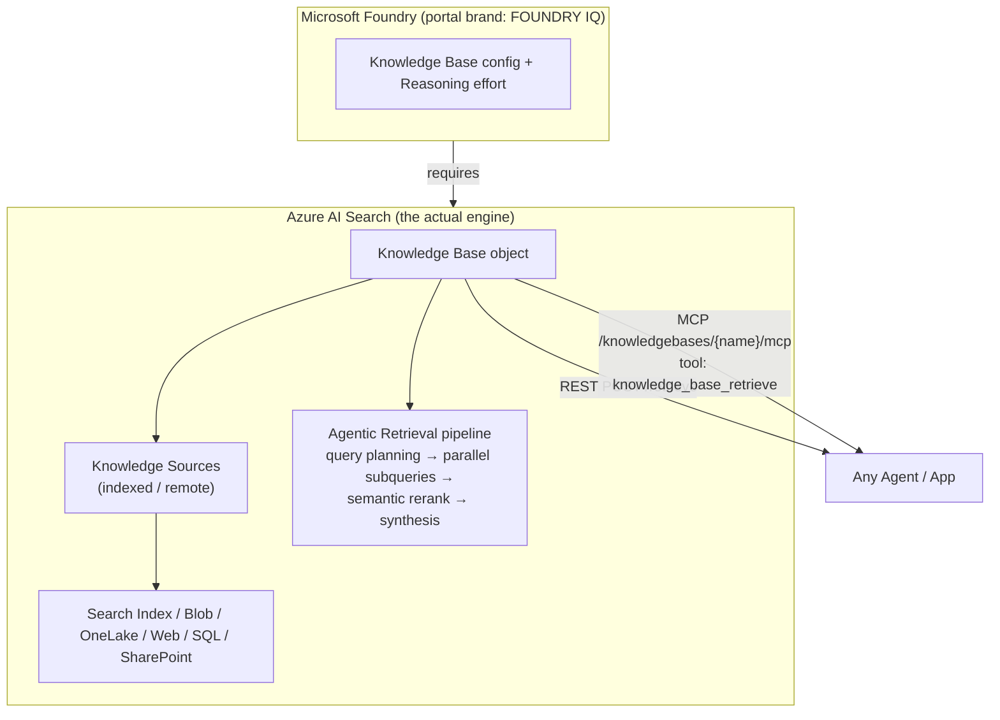
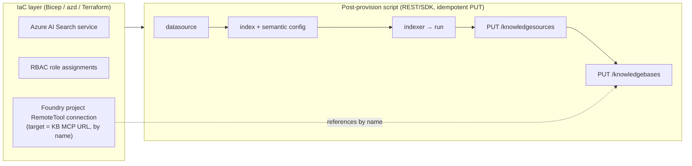

# Azure AI Foundry IQ — Hosted Agents & CI/CD: Deep Research Report

> **Research questions**
> 1. Can **Foundry IQ** be used with **hosted agents**?
> 2. How do you do **Foundry IQ with CI/CD** (provision + update programmatically)?
>
> *Date: 2026-06-15. Targets Azure AI Search REST `2026-04-01` (GA) and `2026-05-01-preview`.*

---

## Executive Summary

**Foundry IQ** is the Microsoft Foundry brand for a **managed knowledge layer** — reusable, permission-aware *knowledge bases* that ground agents on enterprise data.[^1] Under the hood it **is Azure AI Search "agentic retrieval"**: every Foundry IQ knowledge base and knowledge source is a **data-plane object on an Azure AI Search service**, exposed both as a REST `/retrieve` API and as an **MCP endpoint** (`/knowledgebases/{name}/mcp`).[^2][^3] It was announced in preview at **Microsoft Ignite (November 2025)** and core extractive retrieval reached **GA in April 2026** (`2026-04-01`).[^4]

**Answer to Q1 — Yes, all hosting models can use Foundry IQ.** Microsoft documentation explicitly states knowledge bases work in **Foundry Agent Service**, **Microsoft Agent Framework**, or **any custom application** by calling the Azure AI Search knowledge base APIs.[^1] For hosted/bring-your-own-code agents there are two official sample repos (`foundry-hosted-agentframework-demos`, `foundry-hosted-langchain-demos`) that connect an MCP knowledge tool directly to the KB endpoint.[^5][^6]

**Answer to Q2 — Knowledge bases/sources are NOT ARM resources**, so there is **no Bicep/Terraform/`az search` resource type** for them.[^7][^8] The canonical CI/CD pattern (reference: `Azure-Samples/fibey`) is: **Bicep/azd provisions** the Search service + RBAC + Foundry project connection, then an **idempotent post-provision script** calls the **data-plane REST/SDK** (`PUT /knowledgesources`, `PUT /knowledgebases`) to create/update the knowledge objects.[^9][^10]

**Relevance to this repo (`foundry-data-agent`):** Today it grounds agents on **Azure SQL via a DAB SQL MCP** — there is **no Azure AI Search, RAG, or Foundry IQ** anywhere in the codebase.[^11] Adding Foundry IQ would mean adding a Search service to `infra/`, a post-provision KB script, and an extra MCP tool on the existing hosted agents — it slots cleanly into the existing MCP-based pattern.

---

## 1. What Foundry IQ Is (and isn't)

Foundry IQ = **Azure AI Search agentic retrieval + knowledge bases + Foundry portal UX + native Agent Service integration**.[^2] The MS docs page for agentic retrieval is explicit: *"it powers Foundry IQ in the Microsoft Foundry portal by providing the knowledge layer… [and] it's the basis for custom agentic solutions you build using the Azure AI Search APIs."*[^3]

**Three-component model:**[^1]

| Component | Service | Role |
|---|---|---|
| **Knowledge Base** | Azure AI Search | Top-level orchestrator. References knowledge sources, an optional query-planning LLM, and `retrievalReasoningEffort` (`minimal`/`low`/`medium`). Exposes a REST `/retrieve` action and an MCP endpoint. |
| **Knowledge Source** | Azure AI Search | A connection to content — **indexed** (search index, blob, OneLake, file, SQL) or **remote** (web, SharePoint, Fabric, MCP, Work IQ, queried live). |
| **Agentic Retrieval** | Azure AI Search | Multi-query engine: LLM query planning → parallel keyword/vector/hybrid subqueries → L2 semantic reranking → unified grounded answer + citations → optional self-reflection. |

**Reasoning effort levels** trade cost for quality:[^12]

| Level | LLM query planning | Max sources | Subqueries | Iterative self-reflection |
|---|---|---|---|---|
| `minimal` | No | 10 | 1 | No |
| `low` | Yes | 3 | 3 | No |
| `medium` | Yes | 5 | 5 | Yes |



---

## 2. Q1 — Can Hosted Agents Use Foundry IQ?

**Yes.** The integration surface is the same for everyone — a **knowledge base REST `/retrieve` endpoint** and an **MCP server** (`tool: knowledge_base_retrieve`) — but the wiring differs by hosting model.[^1][^13]

| Hosting model | Integration path | Token scope / auth |
|---|---|---|
| **Foundry Agent Service** (prompt agents) | `MCPTool` + Foundry **project `RemoteTool` connection** | Project Managed Identity → `Search Index Data Reader` |
| **Foundry Hosted Agents** (bring-your-own container) | `MCPStreamableHTTPTool` (Agent Framework) / `MultiServerMCPClient` (LangChain) directly to the KB MCP endpoint, **or** `AzureAISearchContextProvider` auto-injection | `ChainedTokenCredential` → `https://search.azure.com/.default` |
| **Custom / externally hosted** (ACA, anywhere) | Direct REST `POST /knowledgebases/{name}/retrieve`, or MCP via any MCP client | Entra Bearer token → `https://search.azure.com/.default` |

### 2a. Foundry Agent Service (prompt agents)

```python
# learn.microsoft.com/.../how-to/foundry-iq-connect
from azure.ai.projects.models import PromptAgentDefinition, MCPTool

mcp_kb_tool = MCPTool(
    server_label="knowledge-base",
    server_url=f"{search_endpoint}/knowledgebases/{kb_name}/mcp?api-version=2026-05-01-preview",
    require_approval="never",
    allowed_tools=["knowledge_base_retrieve"],
    project_connection_id=project_connection_name,   # Foundry uses this connection for auth
)
agent = project_client.agents.create_version(
    agent_name=agent_name,
    definition=PromptAgentDefinition(model="gpt-4.1-mini", instructions=instructions, tools=[mcp_kb_tool]),
)
```
The project connection is a `RemoteTool` connection with `authType=ProjectManagedIdentity`, `audience=https://search.azure.com/`, targeting the KB MCP URL.[^13] (This is the **same project-connection pattern this repo already uses** for the SQL MCP via `create-foundry-mcp-connection.py`.[^11])

### 2b. Foundry Hosted Agents (bring-your-own-code) — the key answer

The official sample `Azure-Samples/foundry-hosted-agentframework-demos` shows a 4-stage progression (basic → add Foundry IQ → Foundry Toolbox → full hosted agent). **Stage 2** attaches the KB MCP directly inside a hosted container:[^5]

```python
# foundry-hosted-agentframework-demos: agents/stage2_foundry_iq.py
from agent_framework import Agent, MCPStreamableHTTPTool

mcp_url = (f"{os.environ['AZURE_AI_SEARCH_SERVICE_ENDPOINT']}"
           f"/knowledgebases/{os.environ['AZURE_AI_SEARCH_KNOWLEDGE_BASE_NAME']}"
           f"/mcp?api-version=2025-11-01-Preview")
search_token_provider = get_bearer_token_provider(credential, "https://search.azure.com/.default")

async with MCPStreamableHTTPTool(
    name="knowledge-base",
    url=mcp_url,
    http_client=httpx.AsyncClient(auth=BearerTokenAuth(search_token_provider), timeout=120.0),
    allowed_tools=["knowledge_base_retrieve"],
) as kb_mcp_tool:
    agent = Agent(client=client, instructions="...", tools=[kb_mcp_tool])
```

The **Stage 4** production file (`stage4_foundry_hosted.py`) runs as the deployed container using `FoundryChatClient` + `ResponsesHostServer`, combining a Foundry Toolbox (web search + code interpreter) **and** a direct KB MCP tool.[^5] A **known preview bug** is documented in that code: when the KB is bundled inside a Foundry **Toolbox**, the MCP tool name gets a dotted prefix (`knowledge-base.knowledge_base_retrieve`) that the Responses API rejects — the workaround is to keep the KB as a **separate direct MCP connection**.[^5]

LangChain hosted agents use the equivalent `MultiServerMCPClient` with `transport: "streamable_http"` against the same KB MCP URL.[^6]

> **Alternative (non-MCP) mode:** set `FOUNDRY_IQ_CONTEXT_MODE=context_provider` to use `AzureAISearchContextProvider`, which **auto-injects KB results into every turn's context** rather than letting the model decide when to call the tool.[^5]

### 2c. Custom / externally hosted agents — direct REST

No Foundry SDK needed. Any service holding a `https://search.azure.com/.default` bearer token can call:

```http
POST {search_endpoint}/knowledgebases/{kb_name}/retrieve?api-version=2026-04-01
Authorization: Bearer {search_token}
Content-Type: application/json

{
  "intents": [{ "search": "What PerksPlus benefits are there?", "type": "semantic" }],
  "retrievalReasoningEffort": { "kind": "minimal" }
}
```
Security trimming is supported per knowledge source via `knowledgeSourceParams[].filterAddOn` (e.g. `group_ids/any(g:search.in(g,'group1,group2'))`), and per-user enforcement can be passed with the `x-ms-query-source-authorization` header.[^14][^15]

### 2d. Auth & RBAC summary[^13]

| Identity | Role | Where |
|---|---|---|
| Your account | Search Service Contributor + Search Index Data Contributor | Search service (author KB/sources, load docs) |
| Agent **project managed identity** / runtime MI | **Search Index Data Reader** | Search service (query time) |
| Search service **managed identity** | **Cognitive Services User** | Azure OpenAI / Foundry resource (for query-planning LLM) |
| Your account | Foundry Project Manager + Foundry User | Foundry project (create connections, agents) |

Token scopes: query KB → `https://search.azure.com/.default`; create project connections (ARM) → `https://management.azure.com/.default`; call Agent/Responses API → `https://ai.azure.com/.default`.[^13]

---

## 3. Q2 — Foundry IQ with CI/CD

### 3a. The central constraint: knowledge objects are data-plane, not ARM

There is **no** `Microsoft.Search/searchServices/knowledgeBases` or `/knowledgeSources` ARM resource type, **no Bicep/ARM module**, **no Terraform `azurerm`/`azapi` resource**, and **no `az search knowledge-base` CLI command**.[^7][^8] The RBAC action verbs (`Microsoft.Search/searchServices/knowledgeBases/write`) exist for policy but are **not** ARM resources.[^7] Knowledge objects live on `https://{service}.search.windows.net`, so they must be created by **REST or SDK calls in a script**.[^8]



### 3b. Reference template: `Azure-Samples/fibey` (azd)

`fibey` is the canonical `azd` template that deploys a Foundry agent + Foundry IQ KB. It splits responsibilities cleanly:[^9][^10]

**`azure.yaml` runs a data-plane hook after infra:**
```yaml
hooks:
  postprovision: { kind: sh, run: ./scripts/setup-knowledge-base.sh, interactive: true }
  postdeploy:    { kind: sh, run: ./scripts/setup-toolbox.sh }
```

**Bicep (`infra/resources.bicep`) provisions** the Search service, Foundry account/project + model, **all RBAC**, and the **Foundry project connection wired to the KB MCP URL by name — even before the KB exists** (the connection registers the URL; it resolves once the script creates the KB):[^10]
```bicep
var knowledgeBaseMcpEndpoint = '${searchEndpoint}/knowledgebases/${knowledgeBaseName}/mcp?api-version=2026-05-01-preview'
connections: union(aiProjectConnections, [{
  name: 'kb-${knowledgeBaseName}'
  category: 'RemoteTool'
  target: knowledgeBaseMcpEndpoint
  authType: 'ProjectManagedIdentity'
  isSharedToAll: true
  audience: 'https://search.azure.com/'
}])
```

**The post-provision script (`setup-knowledge-base.sh`) creates the data-plane chain** with idempotent PUTs and 503 retry: upload docs → `PUT /datasources` → `PUT /indexes` (with semantic config) → `PUT /indexers` → run → **`PUT /knowledgesources`** → **`PUT /knowledgebases`**, reading config from `azd env get-value`.[^9]

### 3c. Programmatic create/update surface

**REST (data-plane, idempotent PUT):**[^15][^16]
```http
PUT {endpoint}/knowledgesources('{name}')?api-version=2026-04-01   # searchIndex | azureBlob | indexedOneLake | web (GA)
PUT {endpoint}/knowledgebases('{name}')?api-version=2026-04-01
```
Knowledge base body (GA `2026-04-01`):
```json
{
  "name": "my-kb",
  "knowledgeSources": [{ "name": "ks-example-index" }],
  "models": [{ "kind": "azureOpenAI", "azureOpenAIParameters": {
    "resourceUri": "https://my-aoai.openai.azure.com/", "deploymentId": "gpt-4.1-mini", "modelName": "gpt-4.1-mini" }}]
}
```
Preview (`2026-05-01-preview`) adds `retrievalInstructions`, `answerInstructions`, `outputMode` (`answerSynthesis`|`extractedData`), `retrievalReasoningEffort`.[^16]

**Python SDK** (`azure-search-documents`, via `SearchIndexClient`):[^17]
```python
client = SearchIndexClient(endpoint, DefaultAzureCredential())
client.create_or_update_knowledge_source(SearchIndexKnowledgeSource(
    name="my-ks",
    search_index_parameters=SearchIndexKnowledgeSourceParameters(
        search_index_name="my-index", semantic_configuration_name="default",
        source_data_fields=[SearchIndexFieldReference(name="id"), SearchIndexFieldReference(name="content")])))
client.create_or_update_knowledge_base(KnowledgeBase(
    name="my-kb", knowledge_sources=[KnowledgeSourceReference(name="my-ks")],
    models=[KnowledgeBaseAzureOpenAIModel(...)],
    retrieval_reasoning_effort=KnowledgeRetrievalLowReasoningEffort()))
```
.NET mirrors this (`CreateOrUpdateKnowledgeSourceAsync` / `CreateOrUpdateKnowledgeBaseAsync`); JS/Java packages expose the same method names. **C#/JS/Java agent-integration** support lags Python/REST in preview.[^17][^18] (`az search admin-key show` is the only CLI touch-point — used to fetch a key for data-plane auth; prefer managed identity.)[^19]

### 3d. Reference GitHub Actions pipeline

```yaml
jobs:
  provision-infra:        # azd provision → Search service, RBAC, Foundry project connection
    steps:
      - uses: azure/login@v2            # OIDC federated credential (no stored secret)
      - run: azd provision --no-prompt
  setup-knowledge-base:   # data-plane, idempotent
    needs: provision-infra
    steps:
      - uses: azure/login@v2
      - run: ./scripts/setup-knowledge-base.sh   # PUT /knowledgesources, PUT /knowledgebases
  deploy-app:
    needs: setup-knowledge-base
    steps: [ { run: azd deploy --no-prompt } ]
```

**CI/CD design rules:**[^9]

| Concern | Approach |
|---|---|
| Idempotency | All knowledge objects via HTTP **PUT** (create-or-update) — re-runs are safe |
| Secrets | Prefer **`DefaultAzureCredential` + OIDC federated identity**; if keys, pull at runtime via `az search admin-key show` and mask |
| Concurrency | Use `If-Match` ETag on updates |
| Schema change / migration | Create new object under a **new name** → test → delete old (don't overwrite across schema changes) |
| Transient warm-up | Retry 503s (fibey retries ~6×/20s) |
| Env promotion | `azd env` per dev/test/prod; parameterize `KB_NAME`, `searchIndexName`, `foundryModel` in `main.parameters.json` |

For production, assign **Search Service Contributor** to the pipeline service principal, and **Cognitive Services User** to the Search service managed identity on the OpenAI resource (for query planning).[^9]

---

## 4. How This Maps onto `foundry-data-agent` (this repo)

The repo currently has **no Azure AI Search / Foundry IQ / RAG** — grounding is **Azure SQL via DAB SQL MCP**, and infra has no Search resource.[^11] But the building blocks already exist and align with the Foundry IQ pattern:

| Existing asset | Foundry IQ analogue |
|---|---|
| `infra/main.bicep` + modules (azd-driven) | Add a `Microsoft.Search/searchServices` module + RBAC + KB project connection |
| `scripts/create-foundry-mcp-connection.py` (SQL MCP project connection, `RemoteTool`, ProjectManagedIdentity) | Same connection shape, target = KB MCP URL[^13] |
| Hosted agents (`hostedagent/`, `agentframeworkhostedagent/`) already attach an **MCP tool** | Add `knowledge_base_retrieve` MCP tool alongside the SQL MCP tool[^5][^11] |
| `azd provision` flow | Add a **post-provision `setup-knowledge-base` script** (REST PUTs), like `fibey`[^9] |

> Net: introducing Foundry IQ here is additive — a Search service in `infra/`, a post-provision KB script, an RBAC assignment (`Search Index Data Reader` for the agent identity), and one extra MCP tool on the existing hosted agents. No `.github/workflows` exists today,[^11] so a CI/CD pipeline would be net-new.

---

## 5. Key Repositories

| Repo | Purpose |
|---|---|
| [Azure-Samples/fibey](https://github.com/Azure-Samples/fibey) | **Canonical azd template**: Foundry agent + Foundry IQ KB; Bicep + post-provision data-plane script[^9][^10] |
| [Azure-Samples/foundry-hosted-agentframework-demos](https://github.com/Azure-Samples/foundry-hosted-agentframework-demos) | **Hosted (BYO-code) agent + Foundry IQ** via Microsoft Agent Framework, 4-stage[^5] |
| [Azure-Samples/foundry-hosted-langchain-demos](https://github.com/Azure-Samples/foundry-hosted-langchain-demos) | Hosted LangChain/LangGraph agent + Foundry IQ[^6] |
| [Azure-Samples/azure-search-python-samples](https://github.com/Azure-Samples/azure-search-python-samples) → `agentic-retrieval-pipeline-example/` | End-to-end: index → knowledge source → KB → project connection → Agent Service agent[^20] |
| [Azure/azure-rest-api-specs](https://github.com/Azure/azure-rest-api-specs) | REST API/TypeSpec definitions and example JSON for all api-versions[^21] |

---

## 6. Confidence Assessment

**High confidence (official docs + working sample code):**
- Foundry IQ is Azure AI Search agentic retrieval; KB/sources are data-plane objects with a `/retrieve` REST API and MCP endpoint.[^1][^2][^3]
- **All three hosting models can consume Foundry IQ**; hosted BYO-code agents do so with `MCPStreamableHTTPTool`/`MultiServerMCPClient` to the KB MCP URL.[^5][^6]
- **No ARM/Bicep/Terraform/CLI resource** for knowledge objects; CI/CD = IaC for the service + idempotent REST/SDK script for KB/sources (fibey pattern).[^7][^8][^9]
- This repo uses SQL MCP, not Search/Foundry IQ.[^11]

**Medium confidence / inferred:**
- Exact GA vs preview dates (Ignite Nov 2025 preview; `2026-04-01` GA) come from the What's-New changelog; the original marketing blog URLs returned 403/404.[^4]
- The "36% relevance lift" benchmark is cited by the FAQ but the source blog is auth-gated.[^12]
- The GitHub Actions YAML in §3d is a **synthesized reference** based on the fibey hooks, not a verbatim published workflow.[^9]
- Per-service tier limits and pricing figures are indicative from docs; verify current rates on the live pricing page.

**Gaps:**
- `KnowledgeAgentRetrievalClient` was **not found** in any public repo; the public SDK uses `SearchIndexClient` for management + REST/MCP for retrieval.[^17]
- C#/JS/Java **agent-integration** parity with Python/REST is still partial in preview.[^18]
- No Terraform `azapi` data-plane example exists (azapi targets ARM, not `*.search.windows.net`).[^8]

---

## Footnotes

[^1]: Foundry IQ concept — "use knowledge bases in Foundry Agent Service, Microsoft Agent Framework, or any custom application by calling the knowledge base APIs from Azure AI Search." `learn.microsoft.com/en-us/azure/foundry/agents/concepts/what-is-foundry-iq`
[^2]: Foundry IQ FAQ. `learn.microsoft.com/en-us/azure/foundry/agents/concepts/foundry-iq-faq`
[^3]: Agentic retrieval overview — "it powers Foundry IQ … [and] is the basis for custom agentic solutions." `learn.microsoft.com/en-us/azure/search/agentic-retrieval-overview`
[^4]: Azure AI Search What's New (Foundry IQ preview Nov 2025 / `2026-04-01` GA). `learn.microsoft.com/en-us/azure/search/whats-new`
[^5]: Hosted Agent Framework demo, stages 2 & 4 + toolbox KB dot-name bug/workaround. [Azure-Samples/foundry-hosted-agentframework-demos: agents/stage2_foundry_iq.py, agents/stage4_foundry_hosted.py, infra/create-toolbox.py](https://github.com/Azure-Samples/foundry-hosted-agentframework-demos)
[^6]: Hosted LangChain demo, stage 2. [Azure-Samples/foundry-hosted-langchain-demos: agents/stage2_foundry_iq.py](https://github.com/Azure-Samples/foundry-hosted-langchain-demos)
[^7]: Knowledge objects are not ARM resources (RBAC action verbs only). [MicrosoftDocs/azure-docs: articles/role-based-access-control/permissions/ai-machine-learning.md](https://github.com/MicrosoftDocs/azure-docs/blob/b5f3cb18/articles/role-based-access-control/permissions/ai-machine-learning.md)
[^8]: No `az search` KB commands; Terraform `azurerm`/`azapi` cannot manage data-plane objects. `learn.microsoft.com/en-us/cli/azure/search?view=azure-cli-latest`
[^9]: Canonical post-provision data-plane script (idempotent PUTs, retries). [Azure-Samples/fibey: scripts/setup-knowledge-base.sh](https://github.com/Azure-Samples/fibey/blob/cca816a2/scripts/setup-knowledge-base.sh)
[^10]: Bicep KB MCP project connection wired by name. [Azure-Samples/fibey: infra/resources.bicep](https://github.com/Azure-Samples/fibey/blob/cca816a2/infra/resources.bicep); [azure.yaml](https://github.com/Azure-Samples/fibey/blob/cca816a2/azure.yaml)
[^11]: Local repo exploration — hosted agents use DAB SQL MCP over Azure SQL; no AI Search/Foundry IQ/RAG; no `.github/workflows`. `foundry-data-agent/README.md:10-13`, `app/sql-mcp/dab-config.json:28-172`, `scripts/create-foundry-mcp-connection.py:16-123`, `infra/main.bicep:50-145`
[^12]: Reasoning-effort levels and 36% benchmark. `learn.microsoft.com/en-us/azure/foundry/agents/concepts/foundry-iq-faq`
[^13]: Connect agents to KB — `MCPTool`, project `RemoteTool` connection, RBAC, token scopes. `learn.microsoft.com/en-us/azure/foundry/agents/how-to/foundry-iq-connect`
[^14]: Security trimming / per-user auth via `filterAddOn` and `x-ms-query-source-authorization`. [Azure-Samples/AI-Engineer-Zero-to-Hero: 06-foundry-iq/iq_helpers.py](https://github.com/Azure-Samples/AI-Engineer-Zero-to-Hero)
[^15]: Knowledge Sources — Create or Update (2026-04-01). `learn.microsoft.com/en-us/rest/api/searchservice/knowledge-sources/create-or-update?view=rest-searchservice-2026-04-01`
[^16]: Knowledge Bases — Create or Update (2026-04-01) + preview additions. `learn.microsoft.com/en-us/rest/api/searchservice/knowledge-bases/create-or-update?view=rest-searchservice-2026-04-01`
[^17]: Create a knowledge base (Python/.NET via `SearchIndexClient`). `learn.microsoft.com/en-us/azure/search/agentic-retrieval-how-to-create-knowledge-base`
[^18]: SDK support matrix (Python/REST full; C#/JS/Java partial in preview). `learn.microsoft.com/en-us/azure/foundry/agents/how-to/foundry-iq-connect`
[^19]: `az search admin-key show` for data-plane auth in pipelines. `learn.microsoft.com/en-us/cli/azure/search?view=azure-cli-latest`
[^20]: End-to-end Agent Service + agentic retrieval notebook. [Azure-Samples/azure-search-python-samples: agentic-retrieval-pipeline-example/agent-example.ipynb](https://github.com/Azure-Samples/azure-search-python-samples/tree/main/agentic-retrieval-pipeline-example)
[^21]: REST API specs / api-version migration. [Azure/azure-rest-api-specs: specification/search/data-plane/Search](https://github.com/Azure/azure-rest-api-specs); `learn.microsoft.com/en-us/azure/search/agentic-retrieval-how-to-migrate`
