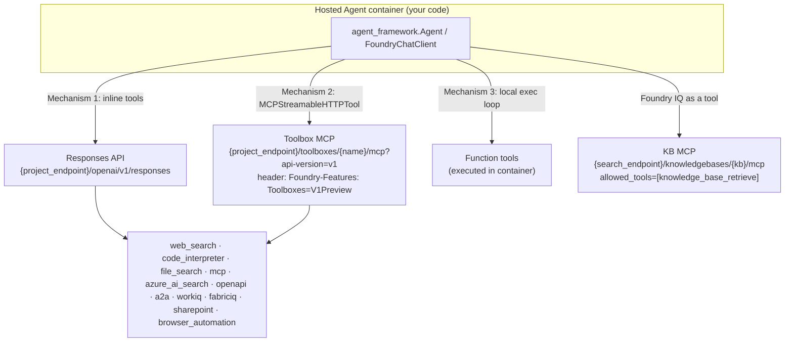

# Azure Foundry IQ, Foundry Tools with Hosted Agents, and CI/CD

**Research date:** 2026-06-15
**Query type:** Technical deep-dive + How-to (process)
**Scope:** (1) What Foundry IQ is, (2) whether Foundry Tools — including Foundry IQ knowledge bases — can be consumed by **hosted agents** (not just prompt agents), and (3) how to do CI/CD for Foundry agents and tools.

---

## Executive Summary

**Foundry IQ** is a managed, permission-aware **knowledge layer** in Microsoft Foundry (formerly Azure AI Foundry), built on Azure AI Search's *agentic retrieval*. It exposes a configurable, multi-source **knowledge base** that agents query as a tool over an **MCP endpoint**.[^1][^2]

**Yes — hosted agents can use Foundry Tools, including Foundry IQ.** Both **prompt agents** (declarative/no-code) and **hosted agents** (your own containerized code: Microsoft Agent Framework, LangGraph, Semantic Kernel, Copilot SDK, etc.) call the **same Responses API** on the Foundry project endpoint and therefore have access to the **same unified tool catalog** — web search, code interpreter, file search, function calling, MCP, OpenAPI, Azure AI Search, A2A, Work IQ, Fabric IQ, SharePoint, Browser Automation — plus **Foundry IQ knowledge bases**.[^3][^4] There is official, production sample code (`stage4_foundry_hosted.py`) of a Microsoft Agent Framework **hosted** agent consuming a Foundry IQ knowledge base.[^5]

For **CI/CD**, the canonical stack is **Azure Developer CLI (`azd`) + the Foundry azd extension** for hosted agents, the **AgentOps Accelerator (`Azure/agentops`)** for pipeline generation + evaluation gates, and the SDK/REST method **`agents.create_version(...)`** as the core deployment primitive. A key nuance: agents and infrastructure (Search, Storage, AI Services) are Bicep/ARM resources, but **toolboxes, knowledge sources, and knowledge bases are data-plane resources** that must be created via REST/SDK/`azd` *after* provisioning — there is no native Bicep for them.[^6][^7]

---

## Part 1 — What Is Foundry IQ?

### Definition

> *"Foundry IQ is a managed knowledge layer for enterprise data. It connects structured and unstructured data across Azure, SharePoint, OneLake, and the web so agents can access permission-aware knowledge."*[^1]

It was branded **"Foundry IQ" in November 2025** (preview), built on Azure AI Search **agentic retrieval** that debuted at **Build 2025 (May 2025)**. Core knowledge-base and four knowledge-source types reached **GA in April 2026** (REST `2026-04-01`); LLM query planning, answer synthesis, and many source types remain **preview** (`2026-05-01-preview`).[^2][^8]

### Three core components

| Component | Lives on | Role |
|---|---|---|
| **Knowledge Base** | Azure AI Search | Orchestrator: which sources to query, reasoning effort, query-planning LLM, retrieval/answer instructions. Exposed as an MCP tool. |
| **Knowledge Source** | Azure AI Search | A connection to data — **indexed** (chunked/vectorized/ACL-synced) or **remote** (queried live). |
| **Agentic Retrieval** | Azure AI Search | The engine: LLM query decomposition → parallel subqueries → semantic rerank → merged, cited result. |

A Foundry IQ knowledge base **is** an Azure AI Search resource. It is consumable from *"Foundry Agent Service, Microsoft Agent Framework, or any custom application by calling the knowledge base APIs from Azure AI Search."*[^1]

### Knowledge source types (June 2026)

GA (`2026-04-01`): **Search index, Azure Blob, OneLake, Web (Grounding with Bing)**. Preview (`2026-05-01-preview`): Azure SQL, File (direct upload), Indexed/Remote SharePoint, Fabric Data Agent, Fabric Ontology, **MCP Server**, Work IQ.[^9]

### Retrieval reasoning effort

| Level | LLM | Sources | Subqueries | Synthesis |
|---|---|---|---|---|
| Minimal | None | up to 10 | direct | No |
| Low | Yes | up to 3 | up to 3 | Yes (5k-token budget) |
| Medium | Yes | up to 5 | up to 5 | Yes (10k-token budget); iterative |

Microsoft reports agentic retrieval achieves **~36% higher response quality** than single-shot RAG.[^2]

### How agents consume it

The knowledge base is exposed at an **MCP endpoint** and the agent calls it as a tool (`knowledge_base_retrieve` is the only supported tool):

```
{search_service_endpoint}/knowledgebases/{kb_name}/mcp?api-version=2026-05-01-preview
```

Agents connect either via a Foundry **`RemoteTool` project connection** (`ProjectManagedIdentity`, audience `https://search.azure.com/`) or by pointing an MCP client directly at the endpoint.[^10]

### The "IQ" family

- **Foundry IQ** — enterprise knowledge layer (Azure, SharePoint, OneLake, web).
- **Fabric IQ** — semantic/analytics layer (OneLake, Power BI, ontologies).
- **Work IQ** — Microsoft 365 collaboration context. (Work IQ is now also a Foundry IQ source type.)[^1]

---

## Part 2 — Can Hosted Agents Use Foundry Tools? (Yes)

### Prompt agents vs. hosted agents

| | Prompt agents (declarative) | Hosted agents (preview) |
|---|---|---|
| What | Instructions + model + tools, no container; managed runtime | Your container code (MAF, LangGraph, SK, Copilot SDK, plain Python) on Foundry serverless compute |
| Tool access | Responses API | **Responses API — same endpoint, same tool catalog**[^3] |

The official overview states it explicitly:

> *"Under the hood, your agent code calls the **Responses API** on your Foundry project endpoint for model inference and tool orchestration … a unified set of platform tools — standard OpenAI tools like file search, code interpreter, and web search, **plus Foundry-exclusive tools like SharePoint, WorkIQ, and Fabric IQ.**"*[^3]

And the comparison table confirms hosted agents get *"Foundry models + platform tools: Yes (via the Responses API on the Foundry project endpoint)."*[^3]

### The Foundry Tool catalog

**Built-in:** Web Search, Code Interpreter, File Search, Function Calling. **Custom:** MCP, OpenAPI, Agent-to-Agent (A2A), Azure AI Search, Bing Custom Search, Work IQ, Fabric IQ, Browser Automation, SharePoint. Plus the **Toolbox** — a Foundry-managed bundle of tools exposed as a single MCP endpoint.[^4]

### Three mechanisms by which hosted agents consume tools



**Mechanism 1 — inline tools on the Responses API.** Hosted code uses `FoundryChatClient` and attaches server-side tools:

```python
# microsoft/agent-framework: foundry_chat_client_with_code_interpreter.py
client = FoundryChatClient(credential=AzureCliCredential())
code_interpreter_tool = client.get_code_interpreter_tool()   # server-side
agent = Agent(client=client, instructions="...", tools=[code_interpreter_tool])
```
[^11]

**Mechanism 2 — Toolbox via MCP** (the production pattern). Define a toolbox once in Foundry; the hosted agent connects with `MCPStreamableHTTPTool`:

```python
# microsoft/agent-framework: foundry_chat_client_with_toolbox.py
toolbox_tool = MCPStreamableHTTPTool(
    name="foundry_toolbox",
    url=os.environ["FOUNDRY_TOOLBOX_ENDPOINT"],          # {project}/toolboxes/{name}/mcp?api-version=v1
    header_provider=make_toolbox_header_provider(credential),  # injects bearer + Foundry-Features header
)
async with Agent(client=FoundryChatClient(...), tools=toolbox_tool) as agent:
    result = await agent.run("What tools do you have access to?")
```
Every toolbox request **must** carry `Foundry-Features: Toolboxes=V1Preview` and a bearer token scoped `https://ai.azure.com/.default`.[^12]

**Mechanism 3 — function tools** executed locally in the container (the model decides, your code runs them).[^13]

### Foundry IQ specifically with a hosted agent — confirmed with production code

The official `Azure-Samples/foundry-hosted-agentframework-demos` repo has a 5-stage progression ending in `stage4_foundry_hosted.py` — a **Microsoft Agent Framework hosted agent** (`FoundryChatClient` + `ResponsesHostServer`) that consumes a Foundry IQ knowledge base:[^5]

```python
from agent_framework.foundry import FoundryChatClient
from agent_framework_foundry_hosting import ResponsesHostServer
from agent_framework import Agent, MCPStreamableHTTPTool

# Foundry IQ knowledge base as an MCP tool
kb_mcp_url = f"{SEARCH_ENDPOINT}/knowledgebases/{KB_NAME}/mcp?api-version=2025-11-01-Preview"
kb_mcp_tool = MCPStreamableHTTPTool(
    name="knowledge_base",
    url=kb_mcp_url,
    http_client=kb_http_client,                      # auth scope: https://search.azure.com/.default
    allowed_tools=["knowledge_base_retrieve"],
    load_prompts=False,
)

client = FoundryChatClient(project_endpoint=PROJECT_ENDPOINT, model=MODEL, credential=credential)
agent = Agent(client=client, name="InternalHRHelper",
              instructions="Use the knowledge base tool to answer and ground all answers...",
              tools=[get_enrollment_deadline_info, toolbox_mcp_tool, kb_mcp_tool],
              default_options={"store": False})
ResponsesHostServer(agent).run()                     # deploys as a Foundry hosted agent
```
[^5]

The managed (prompt-agent) path uses `MCPTool` + a `RemoteTool` connection instead, but the capability is identical.[^10]

### Known limitation (as of mid-2026)

Putting the Foundry IQ KB **inside a Toolbox** and consuming it from a hosted agent's Responses API currently hits a bug: the toolbox names the tool with a dot (`toolbox.knowledge_base_retrieve`) and the Responses API rejects dotted tool names. The documented workaround is to bypass the toolbox and attach a **direct** `MCPStreamableHTTPTool` to the KB endpoint (as above). A fix was expected around late April 2026.[^5] The same dot-name constraint affects the Copilot SDK integration (replace `.` with `_`).[^4]

### Other constraints on hosted agents

- **Preview**; per-session idle timeout 15 min (state persisted to `$HOME`/`/files`).[^14]
- Container listens on **port 8088**; `store: False` because the platform manages history.[^15]
- Each agent gets a **dedicated Entra ID**; `azd deploy` assigns it the **`Foundry User`** role at account scope.[^14]
- **Invocations (WebSocket)** protocol is **North Central US only**; Work IQ / Fabric IQ / A2A / Browser Automation are preview and region-limited.[^14][^4]
- C# SDK does not yet support the KB MCP connection pattern (docs show `–`).[^10]

---

## Part 3 — CI/CD for Foundry Agents and Tools

### The two-phase reality

```mermaid
graph LR
    subgraph P1["Phase 1: Infrastructure (ARM / Bicep / azd provision)"]
        A1["Foundry account + project"]
        A2["Model deployments"]
        A3["Azure AI Search · Storage · ACR · App Insights"]
        A4["Managed identity + RBAC"]
        A5["Project connections (RemoteTool / CognitiveSearch)"]
    end
    subgraph P2["Phase 2: Data-plane (REST / SDK / azd CLI — post-provision)"]
        B1["Knowledge sources (PUT .../knowledgesources)"]
        B2["Knowledge bases (PUT .../knowledgebases)"]
        B3["Toolboxes (azd ai toolbox create / POST .../toolboxes/{n}/versions)"]
    end
    subgraph P3["Phase 3: Agent deploy"]
        C1["azd deploy → az acr build → agents.create_version"]
        C2["Eval gate → PATCH endpoint version_selection_rules"]
    end
    P1 --> P2 --> P3
```



**Why two phases:** toolboxes, knowledge sources, and knowledge bases are **data-plane** resources — there is **no Bicep/ARM resource** for them, so CI/CD must call REST/SDK/`azd` after infra is up.[^6][^7]

### Recommended tooling

| Tool | Role |
|---|---|
| **`azd` + Foundry extension** (`azd ext install microsoft.foundry` / `azure.ai.foundry`) | Scaffold, provision (Bicep), deploy, local run, connections, toolboxes |
| **AgentOps Accelerator** (`Azure/agentops`) | Generates GitHub Actions **and** Azure DevOps pipelines with **evaluation gates** + evidence packs |
| **`agents.create_version(...)`** (`azure-ai-projects` SDK / REST) | Core deploy primitive for prompt **and** hosted agents |
| **Bicep** | Phase-1 infra (no Terraform generated; community Pulumi exists) |
| **GitHub Actions / Azure DevOps** | Pipelines; OIDC federated auth recommended |

### CI/CD for prompt agents

Source of truth is a prompt file (e.g. `.agentops/prompts/agent-instructions.md`). Pipeline: **stage candidate** (`create_version`) → **eval gate** → **record deployed**.[^6]

```python
# Azure/agentops: prompt_deploy.py
created = client.agents.create_version(agent_name, body={
    "definition": {"kind": "prompt", "model": "gpt-4o-mini", "instructions": instructions_text},
    "metadata": {"agentops.env": "dev", "agentops.prompt_sha256": sha, "agentops.git_sha": git_sha},
})
```
[^6] PR-stage versions are tagged `agentops:candidate=true` / `agentops:pr=<N>` so they aren't promoted accidentally.[^6]

### CI/CD for hosted agents

```python
# Azure/azure-sdk-tools: deploy_hosted_agent.py
_run(["az", "acr", "build", "--registry", acr, "--image", f"{image}:{tag}", "."])  # remote build
agent = project.agents.create_version(
    agent_name=image,
    definition=HostedAgentDefinition(
        cpu="2", memory="4Gi",
        container_configuration=ContainerConfiguration(image=image),
        protocol_versions=[ProtocolVersionRecord(protocol=AgentProtocol.RESPONSES, version="1.0.0")],
        environment_variables=env_vars),
    metadata={"enableVnextExperience": "true"})
_wait_for_version_active(project, agent.name, str(agent.version))  # creating → active (poll)
```
Versions are **immutable** once `active`; any code/config change = new version.[^6]

### azd lifecycle (hosted agents)

```bash
azd ext install microsoft.foundry
azd ai agent init -m <manifest-url> --deploy-mode code   # scaffold agent.yaml, azure.yaml, infra/main.bicep
azd provision                                            # Bicep: account, project, model, ACR, identity, RBAC
azd ai agent run                                         # local dev on :8088 + Agent Inspector
azd deploy                                               # az acr build + agents.create_version + route traffic
azd up                                                   # provision + deploy
azd ai agent monitor --follow                            # stream logs
```
[^15][^16] Use `azd` extension **0.1.27-preview+** for the new Foundry-managed serverless backend (≤0.1.25 = legacy ACA backend).[^17]

### Canary / rollback (hosted agents)

Traffic is split via `version_selection_rules` (`FixedRatio`) on the agent endpoint:

```bash
az rest --method PATCH --url "${BASE_URL}/agents/${AGENT_NAME}?api-version=v1" \
  --headers "Foundry-Features=AgentEndpoints=V1Preview" \
  --body '{"agent_endpoint":{"version_selector":{"version_selection_rules":[
     {"agent_version":"1","traffic_percentage":90,"type":"FixedRatio"},
     {"agent_version":"2","traffic_percentage":10,"type":"FixedRatio"}]}}}'
```
Rollback = PATCH 100% back to the old version (old versions stay `active`).[^18]

### Evaluation gates

AgentOps `agentops eval run` exit codes: `0`=pass, `2`=threshold/redteam fail (pipeline fails), `1`=runtime error. Thresholds (e.g. `coherence: ">=3"`, `groundedness: ">=3"`) live in `agentops.yaml`; `agentops doctor --evidence-pack` produces reviewer evidence. Hosted-agent eval sessions are isolated with `x-session-isolation-key: eval-${{ github.run_id }}`.[^6]

---

## Part 4 — Provisioning the Tools Themselves (IaC details)

### Toolbox (data-plane)

REST: `POST {project_endpoint}/toolboxes/{name}/versions?api-version=v1` with header `Foundry-Features: Toolboxes=V1Preview` (first version becomes default). Consumer endpoint always serves the default version at `.../toolboxes/{name}/mcp?api-version=v1`.[^7]

`azd` path:
```bash
azd ai connection create my-gh-conn --kind remote-tool --target https://api.githubcopilot.com/mcp/ \
  --auth-type custom-keys --custom-key "Authorization=Bearer $GITHUB_PAT"
azd ai toolbox create my-toolbox --from-file ./my-toolbox.yaml
```
[^7]

Declarative manifest (`agent.manifest.yaml`, `kind: toolbox`) — connections + toolbox provisioned by `azd ai agent init`:
```yaml
resources:
  - kind: connection
    name: github-mcp-conn
    category: RemoteTool
    authType: CustomKeys
    target: https://api.githubcopilot.com/mcp
    credentials: { type: CustomKeys, keys: { Authorization: "Bearer {{ github_pat }}" } }
  - kind: toolbox
    name: agent-tools
    tools:
      - { type: web_search }
      - { type: mcp, server_label: github, project_connection_id: github-mcp-conn }
```
[^19] There are **15 documented toolbox scenarios** (web_search, file_search, code_interpreter, mcp with 6 auth modes, azure_ai_search, a2a, bing custom, openapi, browser_automation).[^20]

### Foundry IQ knowledge source + knowledge base (data-plane, Azure AI Search)

```http
PUT {search-endpoint}/knowledgesources('{name}')?api-version=2026-04-01
Prefer: return=representation
{ "name": "...", "kind": "azureBlob", "azureBlobParameters": { ...embeddingModel, ingestionSchedule... } }
```
Azure Blob sources auto-generate the full indexer pipeline (datasource, indexer, skillset, index).[^21]

```http
PUT {search-endpoint}/knowledgebases/{name}?api-version=2026-05-01-preview
{ "name": "...", "knowledgeSources": [{"name":"ks-policies"}],
  "outputMode": "answerSynthesis", "models": [{ "kind": "azureOpenAI", ... }],
  "retrievalReasoningEffort": { "kind": "low" } }
```
[^22]

**RBAC for the KB pipeline:** deployer SP needs `Search Service Contributor` + `Search Index Data Contributor`; the Search service MI needs `Cognitive Services User` (LLM) and `Storage Blob Data Reader` (blob); the project MI needs `Search Index Data Reader` to query at runtime.[^23]

### IaC tool support matrix

| Resource | Bicep/ARM | azd CLI | Terraform |
|---|---|---|---|
| AI Search / Storage / ACR | ✅ | ✅ | ✅ |
| Project connection | ✅ via `az rest` | ✅ `azd ai connection create` | ❌ |
| **Toolbox** | ❌ | ✅ `azd ai toolbox create` | ❌ |
| **Knowledge source / base** | ❌ | ❌ (use Search REST) | ❌ |

Toolboxes, knowledge sources, and knowledge bases are **data-plane only** — create them via REST/SDK/`azd` after `azd provision`.[^7] The only full end-to-end IaC example found uses a **community** Pulumi bridged provider (`pulumi_azurefoundry`), not an official Microsoft provider.[^24]

---

## Key Repositories

| Repo | Purpose |
|---|---|
| [microsoft/agent-framework](https://github.com/microsoft/agent-framework) | MAF SDK + Foundry tool/toolbox samples (Python & .NET) |
| [microsoft-foundry/foundry-samples](https://github.com/microsoft-foundry/foundry-samples) | Official hosted-agent samples; `SUPPORTED_TOOLBOX_SCENARIOS.md` (15 scenarios) |
| [Azure-Samples/foundry-hosted-agentframework-demos](https://github.com/Azure-Samples/foundry-hosted-agentframework-demos) | 5-stage hosted-agent + Foundry IQ KB demo (`stage4_foundry_hosted.py`) |
| [Azure/agentops](https://github.com/Azure/agentops) | AgentOps Accelerator: pipeline generation + eval gates |
| [Azure/azure-dev](https://github.com/Azure/azure-dev) | `azd` + `azure.ai.agents` extension and `agent.yaml` schema |
| [Azure/azure-sdk-tools](https://github.com/Azure/azure-sdk-tools) | Real-world ADO pipeline deploying a hosted agent |

---

## Confidence Assessment

**High confidence**
- Foundry IQ definition, components, source types, GA/preview timeline (official Microsoft Learn docs).[^1][^2][^9]
- Hosted agents can consume the full Foundry tool catalog via the shared Responses API (official overview + comparison table).[^3]
- A MAF **hosted** agent consuming a Foundry IQ KB is real and sampled (`stage4_foundry_hosted.py`).[^5]
- `agents.create_version`, `azd` lifecycle, canary via `version_selection_rules`, AgentOps pipelines.[^6][^15][^18]
- Toolboxes/knowledge bases are data-plane (no Bicep); two-phase CI/CD.[^7]

**Medium / inferred**
- The KB-in-toolbox dot-name bug and its ~April-2026 fix come from an inline code comment, not formal docs; treat the timeline as approximate.[^5]
- There is **no single official "CI/CD for Foundry agents" Learn page**; guidance is assembled from the AgentOps repo, the azd devblog, and a detailed community guide (`JimPiquant/evaluation-articles`).[^6]
- Toolbox version-promotion REST shape was partly inferred from the `azd` CLI behavior.[^7]
- `pulumi_azurefoundry` is a community provider, not Microsoft-official.[^24]

**Assumptions**
- "Foundry tools" was interpreted as the Foundry Agent Service tool catalog (including Foundry IQ knowledge bases). URL base is the current `/azure/foundry/` (the older `/azure/ai-foundry/` redirects/404s).[^6]
- Preview features and exact API versions are evolving rapidly; verify the latest `api-version` before implementing.

---

## Footnotes

[^1]: What is Foundry IQ? — https://learn.microsoft.com/en-us/azure/foundry/agents/concepts/what-is-foundry-iq
[^2]: Foundry IQ FAQ (components, reasoning effort, 36% benchmark) — https://learn.microsoft.com/en-us/azure/foundry/agents/concepts/foundry-iq-faq
[^3]: Foundry Agent Service overview (Responses API; hosted vs prompt; platform tools) — https://learn.microsoft.com/en-us/azure/foundry/agents/overview
[^4]: Foundry tool catalog + Toolbox — https://learn.microsoft.com/en-us/azure/foundry/agents/concepts/tool-catalog ; https://learn.microsoft.com/en-us/azure/foundry/agents/how-to/tools/toolbox
[^5]: Hosted MAF agent consuming Foundry IQ KB — `Azure-Samples/foundry-hosted-agentframework-demos:agents/stage4_foundry_hosted.py` (and `stage2_foundry_iq.py`, README) https://github.com/Azure-Samples/foundry-hosted-agentframework-demos
[^6]: AgentOps Accelerator (prompt + hosted CI/CD, eval gates) — `Azure/agentops:src/agentops/pipeline/prompt_deploy.py`, `src/agentops/templates/workflows/*.yml`, `src/agentops/services/cicd.py` https://github.com/Azure/agentops ; community guide `JimPiquant/evaluation-articles:07-deploy-foundry-agents/hosted-agents-developer-guide.md`
[^7]: Toolbox provisioning + data-plane nature — https://learn.microsoft.com/en-us/azure/foundry/agents/how-to/tools/toolbox (pivots: rest-api / python / azd)
[^8]: Azure AI Search What's New (GA/preview timeline) — https://learn.microsoft.com/en-us/azure/search/whats-new
[^9]: Knowledge source overview (supported kinds) — https://learn.microsoft.com/en-us/azure/search/agentic-knowledge-source-overview
[^10]: Connect agents to Foundry IQ (MCPTool + RemoteTool connection) — https://learn.microsoft.com/en-us/azure/foundry/agents/how-to/foundry-iq-connect
[^11]: Code interpreter via FoundryChatClient — `microsoft/agent-framework:python/samples/02-agents/providers/foundry/foundry_chat_client_with_code_interpreter.py` https://github.com/microsoft/agent-framework
[^12]: Toolbox via MCPStreamableHTTPTool — `microsoft/agent-framework:python/samples/02-agents/providers/foundry/foundry_chat_client_with_toolbox.py`
[^13]: Function tools with FoundryAgent — `microsoft/agent-framework:python/samples/02-agents/providers/foundry/foundry_agent_with_function_tools.py`
[^14]: Hosted agents concepts (identity, RBAC, sessions, protocols, regions) — https://learn.microsoft.com/en-us/azure/foundry/agents/concepts/hosted-agents
[^15]: Hosted agent quickstart + basic `main.py`/`Dockerfile`/`agent.yaml` — https://learn.microsoft.com/en-us/azure/foundry/agents/quickstarts/quickstart-hosted-agent ; `microsoft-foundry/foundry-samples:samples/python/hosted-agents/agent-framework/responses/01-basic/`
[^16]: azd AI agent end-to-end — https://devblogs.microsoft.com/azure-sdk/azd-ai-agent-end-to-end/
[^17]: azd extension backend version boundary — `JimPiquant/evaluation-articles:07-deploy-foundry-agents/hosted-agents-developer-guide.md:100-125`
[^18]: Canary/rollback via version_selection_rules — `JimPiquant/evaluation-articles:07-deploy-foundry-agents/hosted-agents-developer-guide.md:701-740`
[^19]: Toolbox `agent.manifest.yaml` (connections + kind: toolbox) — `microsoft-foundry/foundry-samples:samples/python/hosted-agents/agent-framework/responses/04-foundry-toolbox/agent.manifest.yaml`
[^20]: 15 supported toolbox scenarios — `microsoft-foundry/foundry-samples:samples/python/hosted-agents/SUPPORTED_TOOLBOX_SCENARIOS.md`
[^21]: Knowledge sources REST (create/update) — https://learn.microsoft.com/en-us/rest/api/searchservice/knowledge-sources/create-or-update?view=rest-searchservice-2026-04-01
[^22]: Create a knowledge base (REST/SDK) — https://learn.microsoft.com/en-us/azure/search/agentic-retrieval-how-to-create-knowledge-base
[^23]: KB pipeline RBAC + full IaC example — `dirien/from-zero-to-ai-agent-building-with-azure-ai-agent-service:advanced-foundry-deployment/infra/__main__.py:1113-1540`
[^24]: Community Pulumi bridged provider `pulumi_azurefoundry` (KnowledgeSource/KnowledgeBase/ToolboxV2) — https://github.com/dirien/from-zero-to-ai-agent-building-with-azure-ai-agent-service
