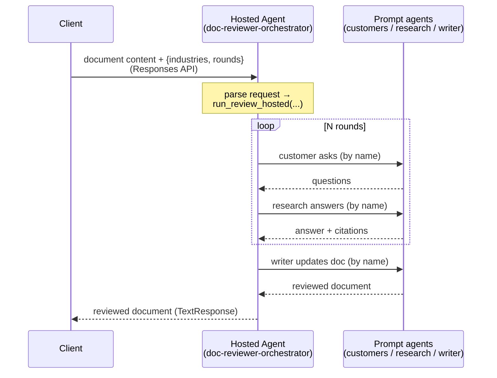
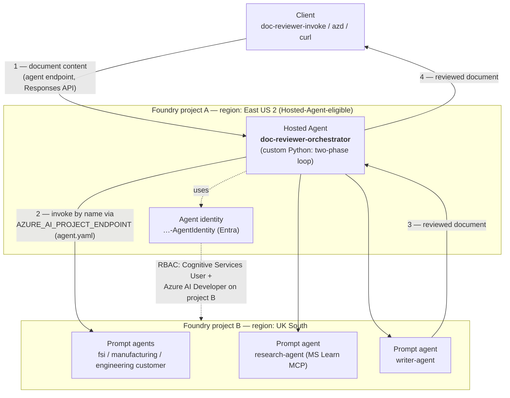

# Hosted Agent: doc-reviewer orchestrator

This package hosts the **orchestrator** (the two-phase review loop) as an Azure AI
Foundry **Hosted Agent** (Pro-code) using the **Responses** protocol. The
sub-agents (FSI / Manufacturing / Engineering customer, Research, Writer) remain
**prompt agents** and are invoked **by name** — this package just wraps
`run_review_hosted` in a managed Azure endpoint.



## Files

| File | Purpose |
|------|---------|
| `server.py` | Responses handler + pure request parser (`parse_review_request`). |
| `main.py` | azd `--deploy-mode code` entrypoint (`python -m doc_reviewer.host.main`). |
| `requirements.txt` | Preview hosting lib (`azure-ai-agentserver-responses`) + projects SDK. |
| `Dockerfile` | Container image (Python 3.13) that installs the project + host deps. |

## Request contract

Send the Responses input as either JSON or plain text:

```json
{ "document": "# My architecture\n...", "industries": ["fsi", "engineering"], "rounds": 3 }
```

- `industries` / `rounds` are optional (default: all industries, `REVIEW_ROUNDS`).
- Plain text is treated as the document with defaults.
- Response body is the reviewed document.
- **Greetings / short chatter** (e.g. `hi`, `hello`, `help`) get a friendly usage
  message instead of triggering an expensive review. An explicit JSON `document`
  is always reviewed, however short.
- **Model rate limits (429)** are retried with exponential backoff per sub-agent
  call; if the quota is still exhausted, the response explains how to fix it
  (wait, lower `rounds`/`industries`, or raise the deployment's TPM quota).

## Invoking when deployed on Azure (send content, not a file path)

> **Important:** Unlike the local `doc-reviewer --file path/to/doc.md` CLI, the
> hosted agent runs in Foundry's cloud and **cannot read files on your machine**.
> You must read the file locally and send its **text** in the `document` field.
> The response body is the reviewed document — save it yourself.

You also need access to invoke the agent: `az login`, and your identity (or the
caller's) needs **Cognitive Services User** + **Azure AI Developer** (or
equivalent Foundry data-plane roles) on the project hosting the agent.

> A hosted agent is invoked through its **own agent endpoint**
> (`.../agents/<name>/endpoint/protocols/openai/responses`), *not* the
> project-level Responses endpoint with an `agent_reference` (that pattern is for
> *prompt* agents). The helper script and examples below use the agent endpoint.

### Option A — `doc-reviewer-invoke` script (easiest)

A small client CLI (`doc_reviewer/host/client.py`) reads a local file, sends its
content to the deployed agent, streams the result, and saves it:

```bash
pip install ".[host]"   # azure-ai-projects + openai

export DOC_REVIEWER_AGENT_ENDPOINT="https://<account>.services.ai.azure.com/api/projects/<project>"
doc-reviewer-invoke --file docs/architecture.md --industry fsi --rounds 1
# -> writes docs/architecture_reviewed.md
```

Flags: `--file` (required), `--industry` (repeatable), `--rounds`, `--output`,
`--agent-name` (default `doc-reviewer-orchestrator`), `--project-endpoint`
(or `$DOC_REVIEWER_AGENT_ENDPOINT`), `--no-stream`. The endpoint is the project
that **hosts the orchestrator** (printed by `azd deploy`) — which may differ from
`AZURE_AI_PROJECT_ENDPOINT` (the project hosting the sub-agent prompt agents).

### Option B — `azd ai agent invoke` (build the payload from a local file)

Use `jq --rawfile` to safely embed the file's content as a JSON string:

```bash
# from the repo root; replace the agent/service name if different
PAYLOAD=$(jq -n --rawfile doc ./docs/architecture.md \
  '{document: $doc, industries: ["fsi"], rounds: 1}')

azd ai agent invoke doc-reviewer-orchestrator "$PAYLOAD" > docs/architecture_reviewed.md
```

For defaults (all industries, `REVIEW_ROUNDS` rounds) you can send the raw text:

```bash
azd ai agent invoke doc-reviewer-orchestrator "$(cat ./docs/architecture.md)"
```

### Option C — Python (OpenAI SDK against the agent endpoint)

Reads a local file, sends its content, writes the reviewed result back:

```python
import json
from pathlib import Path

from azure.identity import DefaultAzureCredential
from openai import OpenAI

# Project that hosts the orchestrator agent (the deploy output prints this).
PROJECT_ENDPOINT = "https://<account>.services.ai.azure.com/api/projects/<project>"
AGENT_NAME = "doc-reviewer-orchestrator"

src = Path("docs/architecture.md")
payload = json.dumps(
    {"document": src.read_text(encoding="utf-8"), "industries": ["fsi"], "rounds": 1}
)

token = DefaultAzureCredential().get_token("https://ai.azure.com/.default").token
client = OpenAI(
    base_url=f"{PROJECT_ENDPOINT}/agents/{AGENT_NAME}/endpoint/protocols/openai",
    api_key=token,
    default_query={"api-version": "v1"},
)

resp = client.responses.create(input=payload)   # no agent_reference for hosted agents

out = src.with_name(f"{src.stem}_reviewed{src.suffix}")
out.write_text(resp.output_text, encoding="utf-8")
print(f"Wrote {out}")
```

To stream progress, add `stream=True` and collect `event.delta` from
`response.output_text.delta` events.

### Option D — curl (raw HTTPS)

```bash
ENDPOINT="https://<account>.services.ai.azure.com/api/projects/<project>/agents/doc-reviewer-orchestrator/endpoint/protocols/openai/responses?api-version=v1"
TOKEN=$(az account get-access-token --resource https://ai.azure.com --query accessToken -o tsv)

# Inner = the orchestrator payload; then wrap it as the Responses `input` string.
INNER=$(jq -n --rawfile doc ./docs/architecture.md '{document: $doc, industries: ["fsi"], rounds: 1}')
curl -s "$ENDPOINT" \
  -H "Authorization: Bearer $TOKEN" -H "Content-Type: application/json" \
  -d "$(jq -n --arg inp "$INNER" '{input: $inp}')" \
  | jq -r '.output[].content[]?.text // empty' > docs/architecture_reviewed.md
```

> Tip: large documents are fine in the request body, but the review takes time
> (roughly a minute per round per industry). Keep `rounds` small for quick runs,
> and prefer the Python/streaming option for long documents so you see progress.

## Prerequisites

- **Python 3.13+** (Hosted agents require it; the rest of the project supports 3.11+).
- The sub-agents already deployed as prompt agents:
  ```bash
  pip install ".[deploy]"
  doc-reviewer-deploy --publish
  ```
- A Foundry project + `az login`. Container identity needs **Foundry User** /
  project roles to invoke the sub-agents and call models, plus **AcrPull**.
- `azd >= 1.25.3` and the Foundry extension:
  ```bash
  azd ext install microsoft.foundry
  ```
- Configure `.env` (see repo `.env.example`): `AZURE_AI_PROJECT_ENDPOINT`,
  `AZURE_AI_MODEL_DEPLOYMENT_NAME`, etc.

## Deploy with azd (code mode)

Run from this directory (`src/doc_reviewer/host/`):

```bash
azd ai agent init --protocol responses --deploy-mode code   # scaffolds azure.yaml
azd provision                                               # App Insights, etc.
azd ai agent run                                            # local test + inspector
azd ai agent invoke --local '{"document": "# Doc\n...", "rounds": 1}'
azd deploy                                                  # deploy to Foundry
azd ai agent invoke '{"document": "# Doc\n...", "rounds": 1}'
```

> If azd code packaging does not include the parent project, deploy via the
> container path instead (build the `Dockerfile` from the repo root and use
> `azd ai agent init --deploy-mode container`).

## Local smoke test (no azd)

```bash
pip install ".[host]"          # needs Python 3.13
doc-reviewer-host              # starts the Responses server locally
```

## Observability (Foundry Control Plane traces)

Traces and logs surface in **Foundry Control Plane** (Operate → Assets → select
the agent → **Traces**) from the **Application Insights** resource connected to
the agent's project. `azd provision` creates that App Insights and connects it,
and the platform injects `APPLICATIONINSIGHTS_CONNECTION_STRING` into the
container.

Because this is a **custom-code** agent, it wires OpenTelemetry → Azure Monitor
itself (`host/observability.py`, via `azure-monitor-opentelemetry`) so the
detailed spans show up:

- `doc_review` — one span per review request (attributes: industries, rounds,
  document/output sizes).
- `invoke_agent <name>` — one span per sub-agent call (GenAI conventions:
  `gen_ai.operation.name`, `gen_ai.agent.name`), plus the underlying
  `POST .../responses` dependency to each prompt agent.

`flush_telemetry()` force-flushes after each request so buffered spans are
exported before the sandbox scales to zero. To disable capturing prompt/response
content in spans (reviewed docs may be sensitive), set
`OTEL_INSTRUMENTATION_GENAI_CAPTURE_MESSAGE_CONTENT=false`.

Query the traces directly with the Azure CLI (use `-o json`; `-o table` can drop
rows):

```bash
az monitor app-insights query --app <appinsights-name> -g <rg> \
  --analytics-query "union requests,dependencies | where timestamp > ago(1h) and name startswith 'doc_review' or name startswith 'invoke_agent' | project timestamp, name, duration" \
  -o json
```

Or stream container stdout/stderr with `azd ai agent monitor doc-reviewer-orchestrator`.

## Notes

- The local `research/` corpus is bundled into the image by the Dockerfile (it
  copies the repo). Set `RESEARCH_DIR` if you relocate it.
- Hosted agents are in **preview**; pin the `azure-ai-agentserver-*` beta and use
  a [supported region](https://learn.microsoft.com/azure/foundry/agents/concepts/hosted-agents#region-availability).

## Cross-project / cross-region topology

The Hosted Agent and the prompt agents can live in **different Foundry projects**
(and different regions). This is the case for this deployment because Hosted
Agents are region-gated: the orchestrator was provisioned in a supported region
(East US 2) while the prompt agents stayed in their original project (UK South).
The orchestrator reaches the other project via the `AZURE_AI_PROJECT_ENDPOINT`
env var in `agent.yaml`, and its **dedicated agent identity** is granted
data-plane roles on that project so the by-name calls are authorized.



> To keep everything in **one** project instead, deploy the prompt agents into
> the Hosted-Agent-eligible project (`doc-reviewer-deploy --publish` against that
> project) and point `AZURE_AI_PROJECT_ENDPOINT` there; the cross-project RBAC
> grant is then unnecessary.
